# Admin guide: testers, Pro access and support

This is the manual for whoever runs Estudio Vocal day to day: giving testers
Pro, taking it back, gift codes, answering the usual support messages, and the
few maintenance jobs that need a terminal.

Every procedure here was carried out against the real worker code with made-up
people before it was written down (see [How this guide was tested](#11-how-this-guide-was-tested)).
The screenshots come from that run. The site is in Spanish by default, so
buttons are named the way you see them, with the English in brackets. The admin
page has an **English** button in its top bar if you prefer.

> Nothing in this file is private. Real admin addresses, the Cloudflare
> account and where the keys live are in the private notes kept outside this
> public repository.

## Where things are

| You want to… | Where | Section |
|---|---|---|
| Give a tester Pro | Admin page | [1](#1-give-a-tester-pro) |
| Take Pro away | Admin page | [2](#2-remove-pro-from-someone) |
| See what someone has | Admin page | [3](#3-see-what-someone-has) |
| Add more days | Admin page | [4](#4-give-more-days) |
| Hand out a code | Admin page | [5](#5-gift-codes) |
| Answer a support message | This guide | [6](#6-support-answers) |
| Add or remove an admin | Mac terminal | [7](#7-add-or-remove-an-admin) |
| Health, clean-up, lists, deleting data, signing someone out, backups, logs, deploys | Admin page and Mac terminal | [8](#8-maintenance) |
| Practise without touching anyone real | Your computer | [9](#9-practise-in-the-sandbox) |

The admin page is **https://pillb.github.io/vocal-singing-training/admin.html**.
You can also reach it from the practice site: **Cuenta** (Account) → under
**Regalar meses** (Gift months) → **Abrir el panel de admin**. That link only
shows for admins.

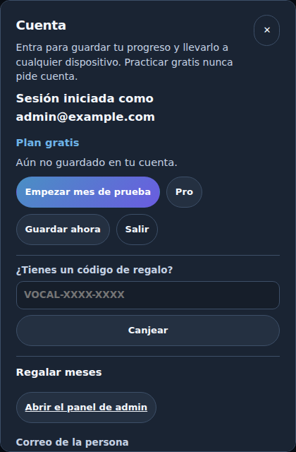

## 0. Before you start

**You must be an admin.** An admin is an address on the worker's `ADMIN_EMAILS`
list. Section [7](#7-add-or-remove-an-admin) shows how to change the list.
Anybody can open the admin page, but the server refuses every action from an
address that is not on the list, and the page shows nothing to them:

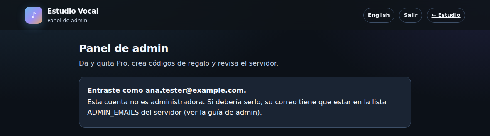

**Sign in.** On the admin page, press Google's **Sign in with Google** button
and pick your admin address. If the button does not appear (an ad blocker or
privacy extension can stop Google's script), sign in from the practice site's
**Cuenta** panel instead, in the same browser, and come back: the admin page
uses the same sign-in.

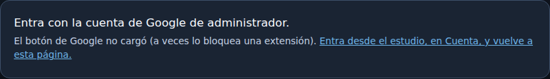

Once in, the page has four parts, with shortcuts at the top: **Buscar** (Look
up), **Dar Pro** (Give Pro), **Códigos** (Codes) and **Mantenimiento**
(Maintenance).

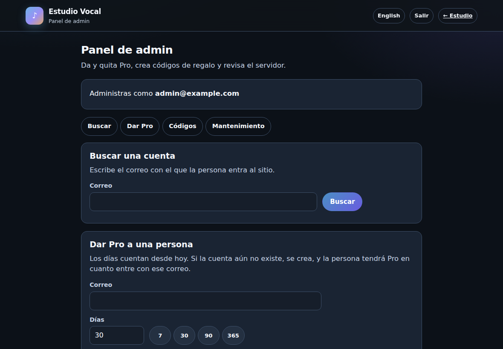

## 1. Give a tester Pro

### Step 1. Can their Google account sign in? (Usually yes, nothing to do)

The site's Google sign-in is set to **Testing** in Google Cloud. For most apps
that means only addresses on a test user list (up to 100) can sign in. But
Google's own help page makes an exception for apps that only ask for a name
and an email address, and for Sign in with Google, which is exactly what this
site does:

> "For such requests, your users do not need to be in the trusted user list,
> they will not see a warning message, and their authorizations will not
> expire after 7 days. If your app uses Sign in with Google to authenticate
> users then this exception also applies."
> (Google Cloud Help, *Manage App Audience*,
> https://support.google.com/cloud/answer/15549945)

So any Google account should be able to sign in, and **who gets Pro is decided
only on the admin page**. This has not yet been confirmed with a real account
that is not on the list. Until it has been, if a tester reports Google's
**"Access blocked … has not completed the Google verification process"** page
(Error 403: access_denied), add them as a test user:

1. Open https://console.cloud.google.com and choose the project that holds the
   site's sign-in client (named in the private notes).
2. Menu → **Google Auth Platform** → **Audience**.
3. Under **Test users**, press **Add users**, type their Google address, and
   press **Save**.

Each address added counts against the project's 100 test users, and Google's
help does not say whether removing one frees its place, so only add people who
actually hit that page. The address must belong to a Google account (Gmail, or
any address someone made a Google account with).

### Step 2. Give Pro on the admin page

1. In **Dar Pro a una persona** (Give Pro to a person), type their address in
   **Correo** (Email).
2. Set **Días** (Days), or press 7, 30, 90 or 365.
3. Optionally write a **Nota** (Note) for yourself, such as "Beta round 2". Only
   admins see it.
4. Press **Dar Pro** (Give Pro).

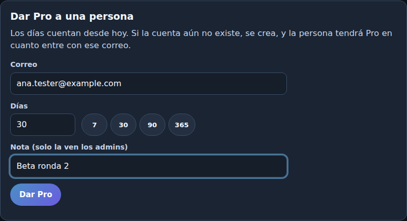

The page confirms with the date Pro ends:

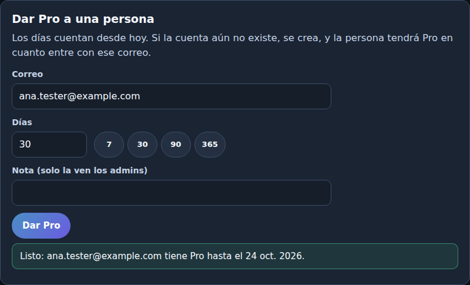

It also looks the person up for you, so you see their account as it now
stands. A tester who has never signed in shows the yellow line **Nunca ha
entrado con este correo** (Has never signed in with this address). That is
expected until they sign in.

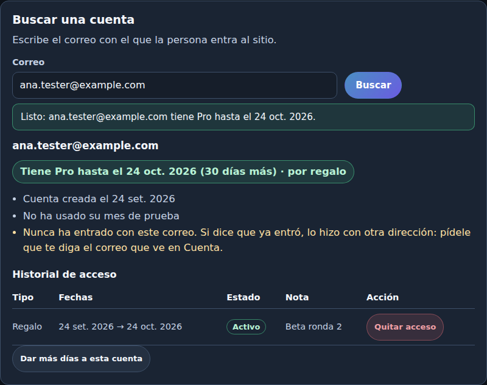

Things to know:

- **Days count from today**, not from when they first sign in.
- **The account does not need to exist yet.** Giving Pro creates it, and the
  person has Pro the moment they sign in with that address.
- **The address must be the one they sign in with.** For Gmail, dots and
  capital letters matter to this site even though Gmail ignores them:
  `ana.perez@gmail.com` and `anaperez@gmail.com` are two different accounts
  here. When in doubt, ask them to sign in first and read you the address
  under **Cuenta**, then give Pro to that.

### Step 3. Tell them how to get in

Send them something like:

> Te di acceso Pro a Estudio Vocal. Entra en
> https://pillb.github.io/vocal-singing-training/ , toca **Cuenta** y entra con
> Google usando **este mismo correo**. Si ya estabas dentro, recarga la página.

### Step 4. Check it worked

After they sign in, they see a green **PRO** badge in the top bar, and
**Cuenta** says **Pro de regalo · termina el …** (Gifted Pro · ends …):


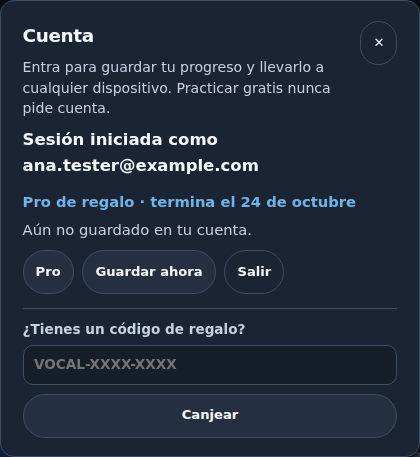

On your side, look them up again: the yellow "never signed in" line is replaced
by **Entra con Google · última vez …** (Signs in with Google · last seen …).

## 2. Remove Pro from someone

1. In **Buscar una cuenta** (Look up an account), type their address and press
   **Buscar** (Look up).
2. In **Historial de acceso** (Access history), find the row that is
   **Activo** (Active) and press **Quitar acceso** (Remove access) on it.
3. Your browser asks you to confirm, naming the person, what you are removing
   and its end date. If something else will keep them on Pro (another gift, a
   code, a subscription), it says so. Press **OK** / **Aceptar**. Press
   **Cancel** / **Cancelar** and nothing changes.

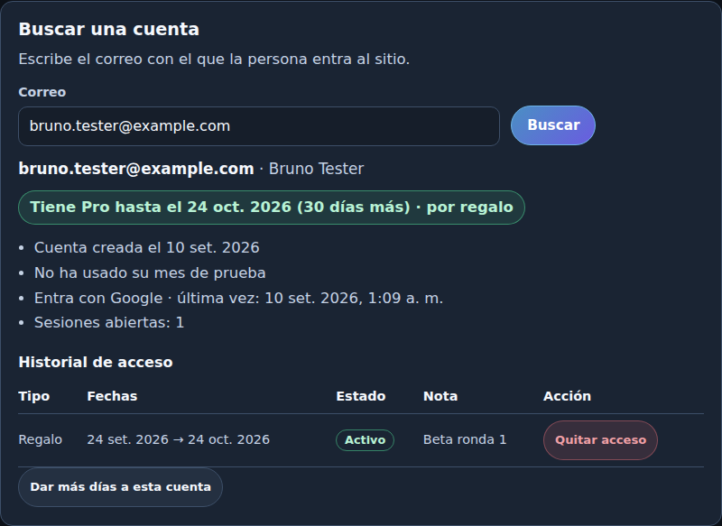

The page answers **Listo: se quitó el acceso** (Done: the access was removed),
the status turns to **Sin Pro ahora mismo** (No Pro right now), and the row
reads **Quitado el …** (Removed on …) with no button:

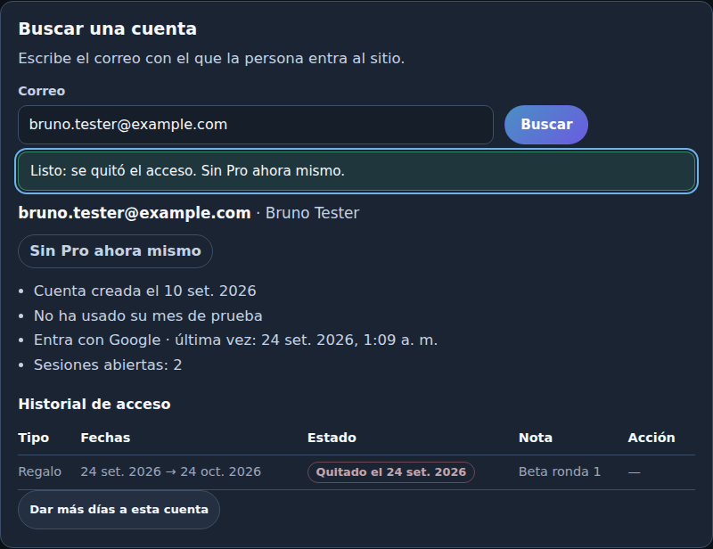

**When they notice:** the next time they open or reload the site, the green
PRO badge is gone and **Cuenta** says **Plan gratis** (Free plan).

| Before | After their next reload |
|---|---|
|  |  |

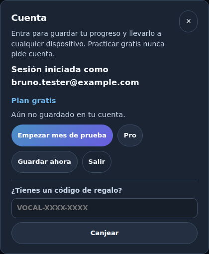

Two edge cases, both by design:

- A tab they never reload keeps Pro until it is reloaded.
- A phone with no connection keeps Pro until its licence expires, at most
  **3 days**. The licence is signed for 72 hours and the site cannot check
  anything while offline.

What removing does **not** do: it does not delete the account or their saved
progress, does not sign them out, and does not stop you giving Pro again later.

**If they had more than one active or scheduled row** (a gift and a code, say),
remove each one. The confirmation warns you, and the status line tells you
whether any Pro is left.

**Removing a free trial** works the same way. The trial stays counted as used,
so they cannot start another one. Give them days instead if you change your
mind.

**Paid subscriptions** (once checkout opens) are not removed here. They show
under **Suscripciones pagadas** (Paid subscriptions) with no button, and are
cancelled in Mercado Pago or Stripe.

## 3. See what someone has

Type the address in **Buscar una cuenta** and press **Buscar**. You get:


- **The status pill**: green **Tiene Pro hasta el … (N días más) · por regalo**
  (Has Pro until … · N more days · from a gift), or grey **Sin Pro ahora mismo**.
  When several things overlap, this shows whichever lasts longest.
- **Cuenta creada el …** (Account created …).
- **Ya usó su mes de prueba** / **No ha usado su mes de prueba**: whether they
  have used their one free trial month.
- **Entra con Google · última vez …** or, in yellow, **Nunca ha entrado con este
  correo**. **Sesiones abiertas** (Open sessions) counts browsers where they are
  signed in now. *These two lines appear once the worker has been redeployed
  with this change (section [8.7](#87-redeploy-the-worker)); before that the
  look-up simply leaves them out.*
- **Historial de acceso**: every trial, gift and comp they ever had, newest
  first. **Tipo** (Kind) is **Prueba gratis** (Free trial), **Regalo** (Gift) or
  **Cortesía** (Comp); a gift from a code says which code. **Estado** (Status)
  is **Activo**, **Programado** (Scheduled, not started yet), **Vencido**
  (Expired) or **Quitado el …** (Removed on …).

If nobody has that address, the page says so. Nobody has signed in with it and
nobody has given it Pro. **Dar más días a esta cuenta** (Give this account more
days) copies the address into the Give Pro form.

On a phone, each row of the table becomes a small card:

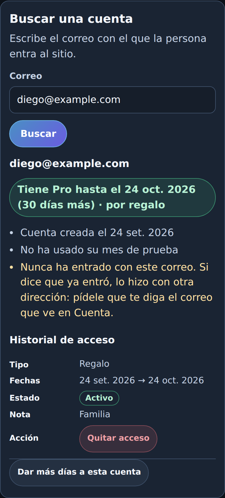

## 4. Give more days

Give Pro again (section [1, step 2](#step-2-give-pro-on-the-admin-page)).
Gifts do **not** add up: each one runs from today for its own number of days,
and the person has Pro until the latest end date among them.

- To extend someone who has 10 days left by a month, give **40** days, not 30.
- If you give fewer days than they already have, nothing changes, and the page
  tells you so: **ya tenía acceso hasta el …, así que su fecha final no cambia**
  (already had access until …, so their end date does not change).

## 5. Gift codes

A code is for when you don't know, or don't want to type, someone's address: a
group chat, a class, a raffle. Whoever types it gets the days, counted from
when they redeem it.

**Make one:**

1. In **Códigos de regalo** (Gift codes), set **Días** (Days) and **Usos**
   (Uses: how many different people can redeem it).
2. Optionally add a **Nota** (Note), such as "Coro del barrio".
3. Press **Crear código** (Create code).
4. Press **Copiar mensaje para enviar** (Copy message to send) and paste it into
   WhatsApp or email. It carries the site's address, the steps and the code.
   **Copiar código** (Copy code) copies just the code.

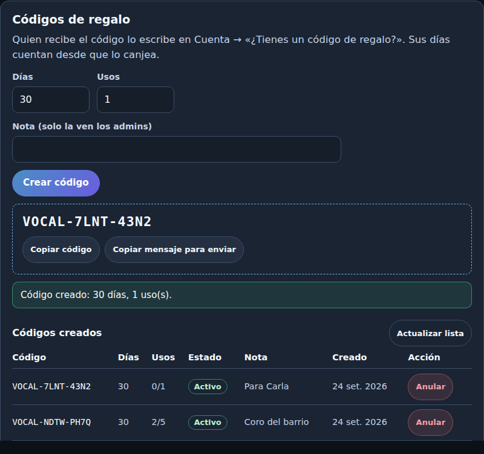

**How they redeem it:** they sign in, open **Cuenta**, type the code under
**¿Tienes un código de regalo?** (Have a gift code?) and press **Canjear**
(Redeem). Dashes, spaces and small letters don't matter.

| Typing the code | Right after |
|---|---|
| 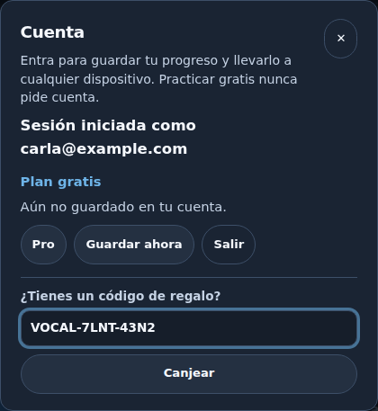 | 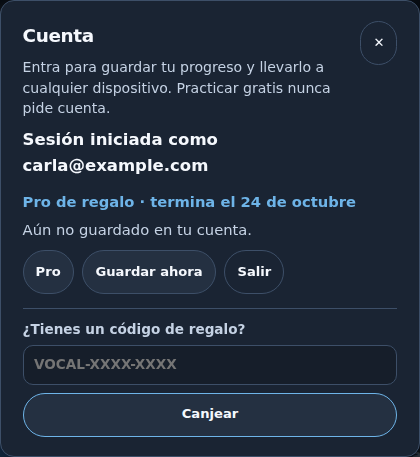 |

**The list of codes** shows, for each: days, uses (**2/5** means two of five
used), **Estado** and your note. **Activo** can still be redeemed; **Agotado**
(Used up) has no uses left; **Anulado** (Cancelled) was cancelled by an admin;
**Vencido** (Expired) has passed an expiry date.

**Cancel a code** with **Anular** (Cancel) and confirm. Nobody else can redeem
it. People who already redeemed it **keep their days**: to take those back,
look each person up and remove the row that says **con el código …**
(with code …).

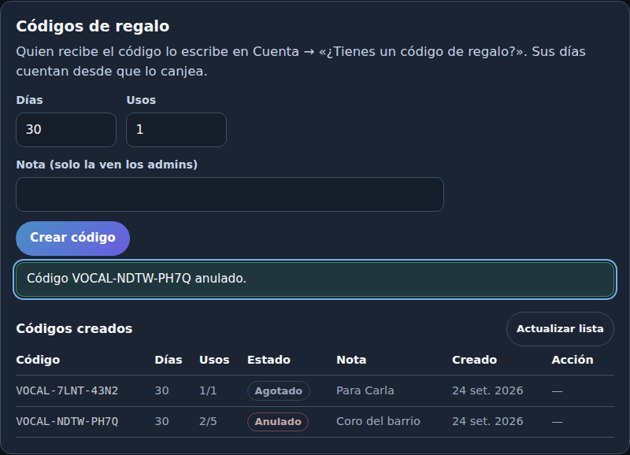

The list shows the latest 100 codes. **Actualizar lista** (Refresh list)
re-reads it, for example after another admin made a code.

## 6. Support answers

**"It says Access blocked" / "Acceso bloqueado: … no completó el proceso de
verificación de Google" / Error 403: access_denied.** Google is holding back an
address that is not on the test user list. Google's help says this site's kind
of sign-in is exempt, so this should not happen; if it does, add them as a
test user ([1, step 1](#step-1-can-their-google-account-sign-in-usually-yes-nothing-to-do)),
ask them to try again, and note in this guide that the exemption did not hold.

**"I signed in but I don't have Pro."**
1. Ask them to reload the page.
2. Ask them what address **Cuenta** shows after **Sesión iniciada como**
   (Signed in as).
3. Look up **that** address. If it has no Pro, you probably gave Pro to a
   different spelling. Give it to this one, and remove the other if you like.
   Looking up the address you originally used will show **Nunca ha entrado con
   este correo**.

**"The Google button doesn't show."** The site says so itself when a blocker
stops Google's script. Ask them to allow the site in their ad blocker, or try
another browser.

**"Error 400: origin_mismatch" on Google's screen.** The site's address is
missing from the sign-in client's **Authorized JavaScript origins**. In Google
Cloud: **Google Auth Platform** → **Clients** → the web client → add
`https://pillb.github.io` (no path, no slash at the end) → **Save**. Google says
changes can take a few minutes to a few hours.

**"My free month ended. Can I have another?"** The trial is once per account,
ever. Give them days instead (section [1, step 2](#step-2-give-pro-on-the-admin-page)).

**"I changed phones / my progress is gone."** Progress is saved to the account
when they are signed in. They sign in on the new device with the **same**
address and press **Guardar ahora** (Save now) on the old one if they still have
it. Recordings never leave the device they were made on, so those do not move.

**"Delete my account."** Section [8.5](#85-delete-someones-account-and-data).

**"Someone else has my phone" / "sign me out everywhere".** Section
[8.6](#86-sign-someone-out-everywhere).

**"I paid and don't have Pro."** Checkout is not open yet, so nobody can have
paid. Once it is, see the payments runbook, [docs/34](34-PERU-OPERATOR-RUNBOOK.md).

## 7. Add or remove an admin

The admin list is a secret called `ADMIN_EMAILS` on the worker: addresses
separated by commas. It is not in this repository, because the repository is
public.

**Change the list.** This replaces the whole list, so type every address that
should be an admin afterwards, yourself included.

1. Open Terminal on the Mac and get ready as in [8.0](#80-get-the-terminal-ready).
2. Run:

   ```bash
   npx --yes wrangler@4 secret put ADMIN_EMAILS
   ```

3. At **Enter a secret value:** type or paste the full list, separated by
   commas and nothing else, for example
   `first.admin@gmail.com,second.admin@gmail.com`, then press Enter. The
   terminal may not show what you type.
4. Wrangler answers that it uploaded the secret. It takes effect straight away;
   there is nothing else to deploy.

What happens next:

- **Someone removed** is refused on their very next action on the admin page
  (**Tu cuenta ya no es administradora**, Your account is no longer an admin),
  and sees the "not an admin" page when they reload. Their own account, Pro and
  progress are untouched.
- **Someone added** opens the admin page, signs in, and has the tools. The
  **Abrir el panel de admin** link in their **Cuenta** panel appears once the
  worker has been redeployed with this change ([8.7](#87-redeploy-the-worker));
  until then they open the admin page by its address.

**Nobody can read the list back**, not even Cloudflare's dashboard:
`npx --yes wrangler@4 secret list` shows only the name `ADMIN_EMAILS`. If you
are not sure what it holds, set it again with the list you want.

Both steps were tried on a local copy of the worker: the page switched from
admin to "not an admin" on the next action, with no redeploy.

## 8. Maintenance

The admin page covers the everyday checks. The rest runs in a terminal on the
Mac, from the `workers/entitlements` folder of the checkout where
`scripts/setup.sh` was run. That checkout matters: its `wrangler.toml` holds
the real database id, while the copy on GitHub has placeholders on purpose.

### 8.0 Get the terminal ready

Do this once each time you open a new Terminal window for maintenance.

**1. Go to the right folder.** The path of the checkout is in the private notes.

```bash
cd PATH-TO-THE-CHECKOUT/workers/entitlements
grep -E '^(id|preview_id|database_id) *=' wrangler.toml
```

The second command must print long ids. If it prints `TODO_REPLACE…`, you are
in a copy that was never set up: stop, and find the checkout the private notes
name.

**2. Sign in to Cloudflare**, one of two ways:

- **Wrangler login** (simplest for occasional jobs). Run
  `npx --yes wrangler@4 login`, approve in the browser window it opens, then
  `npx --yes wrangler@4 whoami` to see the account. It stays signed in on
  that Mac until you run `npx --yes wrangler@4 logout`.
- **An API token for this session only.** In the Cloudflare dashboard: your
  profile icon → **My Profile** → **API Tokens** → **Create Token** → **Create
  Custom Token**, with three account permissions: **Workers Scripts: Edit**,
  **Workers KV Storage: Edit**, **D1: Edit**. Copy it, then in Terminal:

  ```bash
  read -rs CLOUDFLARE_API_TOKEN
  ```

  Paste the token and press Enter (nothing shows; that is on purpose, so it
  never lands in the terminal's history). Then:

  ```bash
  export CLOUDFLARE_API_TOKEN
  export CLOUDFLARE_ACCOUNT_ID='THE-ACCOUNT-ID'
  ```

  The account id is on the dashboard's account home, in the right-hand
  column. When you finish, close the window and delete the token in **API
  Tokens**. A token left in the environment wins over a wrangler login, so
  don't mix the two in one window.

**3. Terminal habits that avoid surprises** on the Mac's default shell (zsh):
paste one command at a time; don't paste lines that start with `#`; and never
put `!` inside double quotes, because zsh treats it as a history command.

Every command below was run in an interactive zsh against a local copy of the
database (`--local` in place of `--remote`) with made-up people, and its
output checked. Commands that change data say so in bold.

### 8.1 Is the server healthy?

On the admin page, **Mantenimiento** → **Estado del servidor** (Server status):

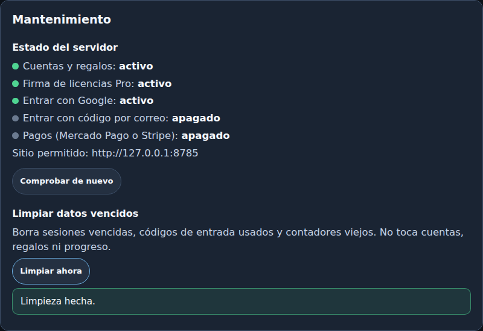

On the live site you should see green for **Cuentas y regalos** (Accounts and
gifts), **Firma de licencias Pro** (Pro licence signing) and **Entrar con Google**
(Sign in with Google), and **Sitio permitido** (Allowed site)
`https://pillb.github.io`. Email codes and payments are off until those stages
of the runbook are done. (The screenshot is from the sandbox, so its allowed
site is a local address.)

From any terminal, without signing in to anything:

```bash
curl -sS https://vocal-studio-entitlements.vocalstudio-pe.workers.dev/v1/health
```

Healthy looks like `"ok":true`, `"signingKeyConfigured":true`,
`"accountsConfigured":true`, `"google":true` and
`"siteOrigin":"https://pillb.github.io"`. `"email":false` and the payment
fields are `false` until those stages are set up. No answer at all means the
worker is down or unreachable: see [8.9](#89-read-the-servers-logs).

### 8.2 Clean up expired data

**Mantenimiento** → **Limpiar ahora** (Clean up now) deletes expired sessions,
used sign-in codes and old rate-limit counters. It never touches accounts,
gifts or progress, so it is safe to press any time. Nothing runs it
automatically yet, so press it every few weeks.

### 8.3 Who has Pro right now

In the Mac terminal ([8.0](#80-get-the-terminal-ready)), read-only:

```bash
npx --yes wrangler@4 d1 execute vocal-studio-accounts --remote --command "SELECT a.email, g.kind, g.note, datetime(g.ends_at, 'unixepoch') AS ends_utc FROM grants g JOIN accounts a ON a.id = g.account_id WHERE g.revoked_at IS NULL AND g.starts_at <= unixepoch() AND g.ends_at > unixepoch() ORDER BY g.ends_at"
```

One row per running trial, gift or comp, soonest to end first. Times are UTC
(Lima is 5 hours behind). Paid subscriptions are not in this list; once
checkout opens, this lists which account each paid licence belongs to:

```bash
npx --yes wrangler@4 d1 execute vocal-studio-accounts --remote --command "SELECT a.email, l.license_id, l.provider, datetime(l.created_at, 'unixepoch') AS linked_utc FROM license_links l JOIN accounts a ON a.id = l.account_id ORDER BY l.created_at DESC"
```

### 8.4 Everyone with an account

Read-only. One row per account: when it was made, when it was last used,
how they sign in (`NEVER` means an address given Pro that has never signed
in), and whether the trial was used.

```bash
npx --yes wrangler@4 d1 execute vocal-studio-accounts --remote --command "SELECT a.email, datetime(a.created_at, 'unixepoch') AS created_utc, (SELECT datetime(MAX(s.last_seen_at), 'unixepoch') FROM sessions s WHERE s.account_id = a.id) AS last_seen_utc, COALESCE((SELECT group_concat(DISTINCT i.provider) FROM identities i WHERE i.account_id = a.id), 'NEVER') AS signed_in_with, CASE WHEN a.trial_used_at IS NULL THEN 'no' ELSE date(a.trial_used_at, 'unixepoch') END AS trial_used FROM accounts a ORDER BY a.created_at"
```

For one person, the admin page's look-up shows the same and more.

### 8.5 Delete someone's account and data

When someone asks for their data to be deleted (Peru's personal data law, Ley
29733, gives them that right), this removes their account, sessions, sign-in
records, gifts and trial, code redemptions, saved progress and counters.

**This cannot be undone from the page or the terminal.** Take a backup first
([8.8](#88-back-up-the-accounts-database)); for 30 days a point-in-time restore
can also bring it back, but that rolls back **everyone's** changes since then.

1. Set the address (between single quotes, exactly as they sign in):

   ```bash
   EMAIL='person@example.com'
   ```

2. Look them up first, on the admin page or with 8.4, to be sure it is the
   right account.
3. **Delete** (one command, all on one line):

   ```bash
   npx --yes wrangler@4 d1 execute vocal-studio-accounts --remote --command "DELETE FROM progress WHERE account_id = (SELECT id FROM accounts WHERE email_normalized = lower(trim('$EMAIL'))); DELETE FROM sessions WHERE account_id = (SELECT id FROM accounts WHERE email_normalized = lower(trim('$EMAIL'))); DELETE FROM identities WHERE account_id = (SELECT id FROM accounts WHERE email_normalized = lower(trim('$EMAIL'))); DELETE FROM gift_redemptions WHERE account_id = (SELECT id FROM accounts WHERE email_normalized = lower(trim('$EMAIL'))); DELETE FROM grants WHERE account_id = (SELECT id FROM accounts WHERE email_normalized = lower(trim('$EMAIL'))); DELETE FROM license_links WHERE account_id = (SELECT id FROM accounts WHERE email_normalized = lower(trim('$EMAIL'))); DELETE FROM rate_limits WHERE bucket = 'login:email:' || lower(trim('$EMAIL')) OR bucket IN (SELECT 'redeem:acct:' || id FROM accounts WHERE email_normalized = lower(trim('$EMAIL')) UNION SELECT 'progress:acct:' || id FROM accounts WHERE email_normalized = lower(trim('$EMAIL'))); DELETE FROM login_codes WHERE email_normalized = lower(trim('$EMAIL')); DELETE FROM accounts WHERE email_normalized = lower(trim('$EMAIL'))"
   ```

   It ends with **9 commands executed successfully**. A typo in the address
   deletes nothing; look them up again to confirm the account is gone.

Worth knowing:

- **Paid licences** (once checkout opens) also live in a separate store. Run
  the paid-licence query in 8.3 before deleting, note their licence id, and
  after deleting run
  `npx --yes wrangler@4 kv key delete "lic:LICENCE-ID" --binding ENTITLEMENTS --preview false --remote`.
  The payment provider keeps its own records; cancel there first.
- **Their own devices** still hold whatever the browser saved (local progress,
  recordings). Tell them to clear the site's data in their browser, or it
  will simply sit there unused.
- If they sign in again later, they get a new, empty account, and can take a
  free trial again.

### 8.6 Sign someone out everywhere

For a lost phone, or "someone else is using my account". **Changes data**, but
only ends sessions: their account, Pro and progress stay.

```bash
EMAIL='person@example.com'
```

```bash
npx --yes wrangler@4 d1 execute vocal-studio-accounts --remote --command "UPDATE sessions SET revoked_at = unixepoch() WHERE revoked_at IS NULL AND account_id = (SELECT id FROM accounts WHERE email_normalized = lower(trim('$EMAIL')))"
```

Every browser where they were signed in drops the session the next time it
opens or reloads the site, and shows Pro again only after they sign in. After
the worker has been redeployed ([8.7](#87-redeploy-the-worker)), the admin
page's look-up shows **Sesiones abiertas: 0** (Open sessions: 0).

### 8.7 Redeploy the worker

Needed only when a change to `workers/entitlements` is merged, for example the
look-up's sign-in lines added with this guide. The site itself redeploys on
its own when `main` changes.

1. Get ready as in [8.0](#80-get-the-terminal-ready), then get the latest code:

   ```bash
   git checkout main
   git pull
   ```

   If git refuses because `wrangler.toml` has local changes, run `git stash`,
   then `git pull`, then `git stash pop`. Those local changes are the real ids;
   never commit them.
2. Check the ids again (the `grep` in 8.0), then deploy:

   ```bash
   npx --yes wrangler@4 deploy
   ```

   It lists the bindings (the database and store should show real ids, not
   `TODO_REPLACE`), then prints the worker's address and a **Version ID**. Note
   that id; it is what you roll back to if needed (8.10).
3. Check health (8.1) and look someone up on the admin page.

Deploying keeps every secret, the database and the store as they are: admins,
the signing key and everyone's Pro are unaffected. `scripts/setup.sh` also
deploys and is safe to re-run, but **run it without `ADMIN_EMAIL` set**: given
that variable it replaces the whole admin list with that one address. Never
pass it `--rotate-key` unless the private key leaked, because every Pro
licence stops verifying until the site ships the new public key.

### 8.8 Back up the accounts database

The file holds everyone's email, so keep it off GitHub and out of this
folder. Read-only on the server.

```bash
mkdir -p ~/vocal-backups
npx --yes wrangler@4 d1 export vocal-studio-accounts --remote --output ~/vocal-backups/accounts-$(date +%Y%m%d).sql
```

A backup restores only into an **empty** database (its tables are created
without "if not exists"), with
`npx --yes wrangler@4 d1 execute DATABASE-NAME --remote --file BACKUP.sql`.
That was tried locally and the row counts matched. For "undo the last few
hours", point-in-time restore is simpler. It works on the live database only,
covers the last 30 days, and rolls back **everything** since the chosen
moment:

```bash
npx --yes wrangler@4 d1 time-travel info vocal-studio-accounts --timestamp 2026-09-24T12:00:00Z
npx --yes wrangler@4 d1 time-travel restore vocal-studio-accounts --timestamp 2026-09-24T12:00:00Z
```

(Only the commands' help was checked for time travel; it cannot run on a
local copy.)

### 8.9 Read the server's logs

Live, while someone reproduces a problem (Ctrl+C stops it):

```bash
npx --yes wrangler@4 tail vocal-studio-entitlements --format pretty --status error
```

Add `--search "some text"` to filter. Past logs are in the Cloudflare
dashboard, on the worker's page (logging is switched on in `wrangler.toml`).
The worker's own log lines never include request bodies, tokens or secrets,
but Cloudflare's request records include each address called, and a look-up's
address carries the email, so treat logs as private.

### 8.10 Undo a bad deploy

```bash
npx --yes wrangler@4 deployments list
npx --yes wrangler@4 rollback VERSION-ID -m "why"
```

A rollback restores the code, and may restore the secrets that version had, so
check the admin list (section 7) afterwards. It does **not** roll back the
database or the licence store.

### 8.11 Limits worth knowing

- The worker runs on Cloudflare's free plan: 100,000 requests a day and 10 ms of
  CPU per request. Signing a licence is the heaviest step. If sign-in starts
  failing with errors under load, the fix is the $5-a-month Workers plan, not a
  code change.
- The codes list on the admin page shows the latest 100 codes.
- Look-ups show up to 200 history rows per person.

### 8.12 Take Google sign-in out of Testing (optional)

If the test-user exemption in section 1 ever turns out not to hold, publishing
the sign-in removes the test-user list altogether: Google Cloud → **Google Auth
Platform** → **Audience** → **Publish app** → **Confirm**. Google's help says
an app that asks only for name and email address does not need Google's
verification for this. Not tried here yet.

## 9. Practise in the sandbox

The sandbox is a private copy of the site and its server on your own computer,
with made-up people in it. Nothing you do there reaches anyone.

```bash
node qa/admin/sandbox.mjs
```

Then open http://127.0.0.1:8780/__sandbox/ and choose who to be:

| Person | Starts as |
|---|---|
| `admin@example.com` | An admin |
| `ana.tester@example.com` | A new tester, no Pro |
| `bruno.tester@example.com` | A tester with a gifted month |
| `carla@example.com` | Used her free month, which has ended |
| `diego@example.com` | Given Pro, has not signed in yet |

The server is the real worker code on a real SQLite database kept in memory;
stopping the script (Ctrl+C) forgets everything. The one thing it cannot do is
Google: "sign in as" writes the same session the Google route writes once
Google has confirmed who someone is. It needs Node 22 or newer and nothing
else.

**Retaking the screenshots** after the account panel or the admin page
changes (the first command is needed once per computer):

```bash
npx playwright install chromium
node qa/admin/capture-guide-shots.mjs
```

It walks through every procedure above and rewrites `docs/admin-guide/*.png`.

## 10. What admins can't do from the page, by design

- **Edit or shorten a gift.** Remove it and give a new one.
- **See progress or recordings.** Recordings never leave the person's device.
- **Change someone's address.** A new address is a new account; give Pro to
  the new one and remove it from the old.
- **Refund or cancel a payment.** That happens in Mercado Pago or Stripe.

## 11. How this guide was tested

Three layers, from most to least automatic:

1. **Browser tests** in `tests/admin.spec.js` drive the real admin page and the
   real practice site in Chromium against the real worker code on a real
   SQLite database. Nothing is mocked except Google. Run them with
   `npx playwright test tests/admin.spec.js`. They also ran 4 times over in
   parallel with no failures.
2. **The sandbox** (section 9) and `qa/admin/capture-guide-shots.mjs` walked
   every procedure with made-up people; the screenshots here are from that run.
3. **Terminal commands** in sections 7 and 8 ran in an interactive zsh against
   a local copy of the database with the same wrangler version the Mac uses.

| Procedure | Browser test | Terminal |
|---|---|---|
| Sign in; non-admins see nothing | signed out: offers admin sign-in… · a member who is not on ADMIN_EMAILS… · an account server that is down reads as down… | |
| 1. Give a tester Pro | give Pro to a tester who has not signed in yet… · give Pro refuses a bad address… · a gift whose answer is lost… | |
| 2. Remove Pro | remove Pro: the tester loses it on their next load · removing one of two gifts warns… · remove a free trial… | |
| 3. See what someone has | look up an address nobody has used… · notes and names are shown as text… | |
| 4. More days | give more days: a shorter gift never shortens access… | |
| 5. Gift codes | gift codes: create, redeem, used up, cancel · cancelling a code does not take days… | |
| 7. Admin list | an admin taken off ADMIN_EMAILS is refused at once… · an admin added… after first signing in… | `secret put`, local |
| 8.1–8.2 Health, clean-up | maintenance: server status and clean-up | `curl` shape checked against the code |
| 8.3–8.6 Lists, delete, sign out everywhere | a session that ends mid-use returns to sign-in… | each query, local |
| 8.7–8.10 Deploy, backup, logs, rollback | | build checked with `deploy --dry-run`; export and restore, local; others by `--help` only |
| Phone, English | on a phone… · works in English too | |

**Still to check on the live site** (only someone with the real accounts can):
signing in to the admin page with a real admin address; a second Google
account that is **not** a Google test user signing in (does Google's exemption
hold?); giving that account 1 day, seeing the green PRO badge, removing it and
seeing the badge go on reload.
