# Admin guide: testers, Pro access and support

This is the manual for whoever runs Estudio Vocal day to day: giving testers
Pro, taking it back, gift codes, answering the usual support messages, and the
few maintenance jobs that need a terminal.

Every procedure here was carried out against the real worker code with made-up
people before it was written down (see [How this guide was tested](#11-how-this-guide-was-tested)).
The screenshots come from that run, last retaken on 28 September 2026. The site is in Spanish by default, so
buttons are named the way you see them, with the English in brackets. The admin
page has an **English** button in its top bar if you prefer.

> Nothing in this file is private. Real admin addresses, the Cloudflare
> account and where the keys live are in the private notes kept outside this
> public repository.

## Where things are

| You want to… | Where | Section |
|---|---|---|
| Give a tester Pro | Admin page | [1](#1-give-a-tester-pro) |
| Take Pro away | Admin page | [2](#2-remove-pro-from-someone) |
| See what someone has | Admin page | [3](#3-see-what-someone-has) |
| Add more days | Admin page | [4](#4-give-more-days) |
| Hand out a code | Admin page | [5](#5-gift-codes) |
| Answer a support message | This guide | [6](#6-support-answers) |
| Add or remove an admin | Mac terminal | [7](#7-add-or-remove-an-admin) |
| Health, clean-up, lists, deleting data, signing someone out, backups, logs, deploys | Admin page and Mac terminal | [8](#8-maintenance) |
| See how sign-in and the free trial are doing | Admin page | [8.13](#813-read-the-statistics) |
| Send someone the data we hold about them | Mac terminal | [8.14](#814-send-someone-the-data-we-hold) |
| Practise without touching anyone real | Your computer | [9](#9-practise-in-the-sandbox) |

The admin page is **https://pillb.github.io/vocal-singing-training/admin.html**.
You can also reach it from the practice site: press your name at the top right
(before you sign in it reads **Entrar**, Sign in) to open your **Cuenta**
(Account) panel, then **Abrir el panel de admin** (Open the admin panel). That
link only shows for admins.

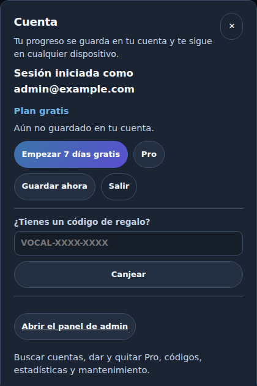

## 0. Before you start

**You must be an admin.** An admin is an address on the worker's `ADMIN_EMAILS`
list. Section [7](#7-add-or-remove-an-admin) shows how to change the list.
Anybody can open the admin page, but the server refuses every action from an
address that is not on the list, and the page shows nothing to them:

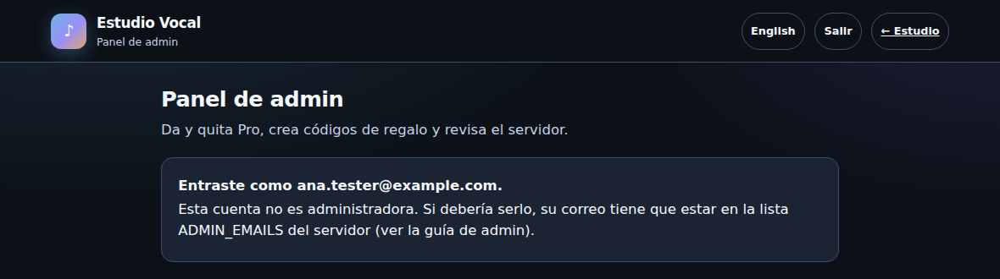

**Sign in.** On the admin page, press Google's **Sign in with Google** button
and pick your admin address. If the button does not appear (an ad blocker or
privacy extension can stop Google's script), sign in on the practice site with
**Entrar** (Sign in) at the top instead, in the same browser, and come back:
the admin page uses the same sign-in.

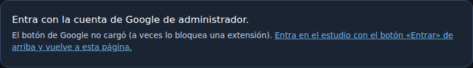

Once in, the page has five parts, with shortcuts at the top: **Buscar** (Look
up), **Dar Pro** (Give Pro), **Códigos** (Codes), **Estadísticas** (Statistics)
and **Mantenimiento** (Maintenance).

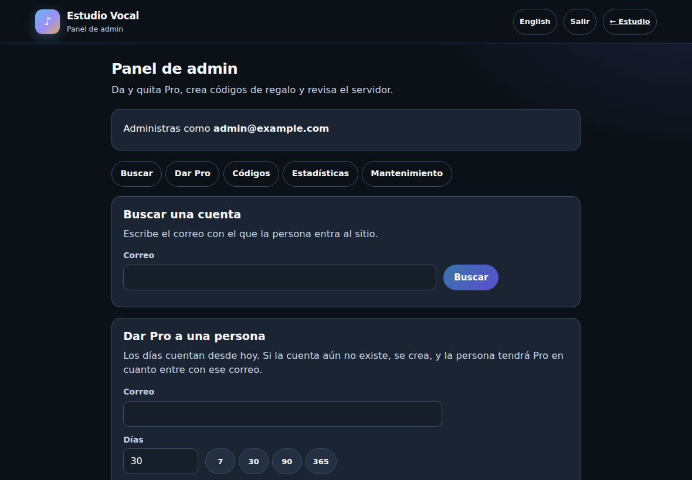

**Before testing on the live site, switch statistics off in every browser you
test with.** At the very foot of the practice site, press **No enviar y borrar
lo enviado** (Stop sending and delete what was sent). A test walks exactly the
steps the statistics count (opening the account panel, signing in, the trial),
and nobody can filter it out afterwards, because statistics are not tied to
accounts. The choice holds in that browser until you press **Volver a permitir**
(Allow again), but not in a private window (each new one starts without it,
so press the button again inside it) and not after clearing the site's data.
Browsers that send Global Privacy Control send nothing anyway and don't show
the button; the older "Do Not Track" setting does not count.

## 1. Give a tester Pro

### Step 1. Can their Google account sign in? (Usually yes, nothing to do)

The site's Google sign-in is set to **Testing** in Google Cloud. For most apps
that means only addresses on a test user list (up to 100) can sign in. But
Google's own help page makes an exception for apps that only ask for a name
and an email address, and for Sign in with Google, which is exactly what this
site does:

> "For such requests, your users do not need to be in the trusted user list,
> they will not see a warning message, and their authorizations will not
> expire after 7 days. If your app uses Sign in with Google to authenticate
> users then this exception also applies."
> (Google Cloud Help, *Manage App Audience*,
> https://support.google.com/cloud/answer/15549945)

So any Google account should be able to sign in, and **who gets Pro is decided
only on the admin page**. This has not yet been confirmed with a real account
that is not on the list. Until it has been, if a tester reports Google's
**"Access blocked … has not completed the Google verification process"** page
(Error 403: access_denied), add them as a test user:

1. Open https://console.cloud.google.com and choose the project that holds the
   site's sign-in client (named in the private notes).
2. Menu → **Google Auth Platform** → **Audience**.
3. Under **Test users**, press **Add users**, type their Google address, and
   press **Save**.

Each address added counts against the project's 100 test users, and Google's
help does not say whether removing one frees its place, so only add people who
actually hit that page. The address must belong to a Google account (Gmail, or
any address someone made a Google account with).

### Step 2. Give Pro on the admin page

1. In **Dar Pro a una persona** (Give Pro to a person), type their address in
   **Correo** (Email).
2. Set **Días** (Days), or press 7, 30, 90 or 365.
3. Optionally write a **Nota** (Note) for yourself, such as "Beta round 2". The
   person doesn't see it, but can ask for it with the rest of their data
   ([8.14](#814-send-someone-the-data-we-hold)), so write only what you would
   show them.
4. Press **Dar Pro** (Give Pro).

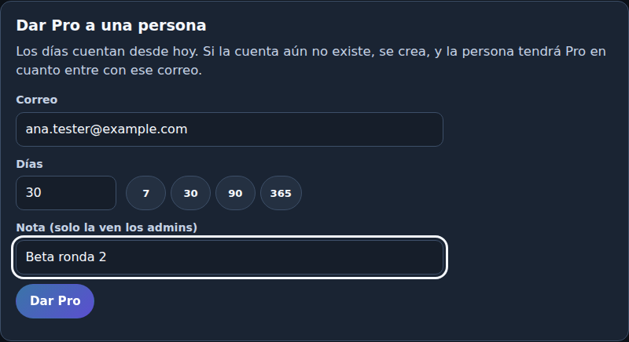

The page confirms with the date Pro ends:

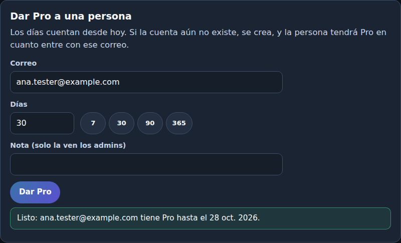

It also looks the person up for you, so you see their account as it now
stands. A tester who has never signed in shows the yellow line **Nunca ha
entrado con este correo** (Has never signed in with this address). That is
expected until they sign in.

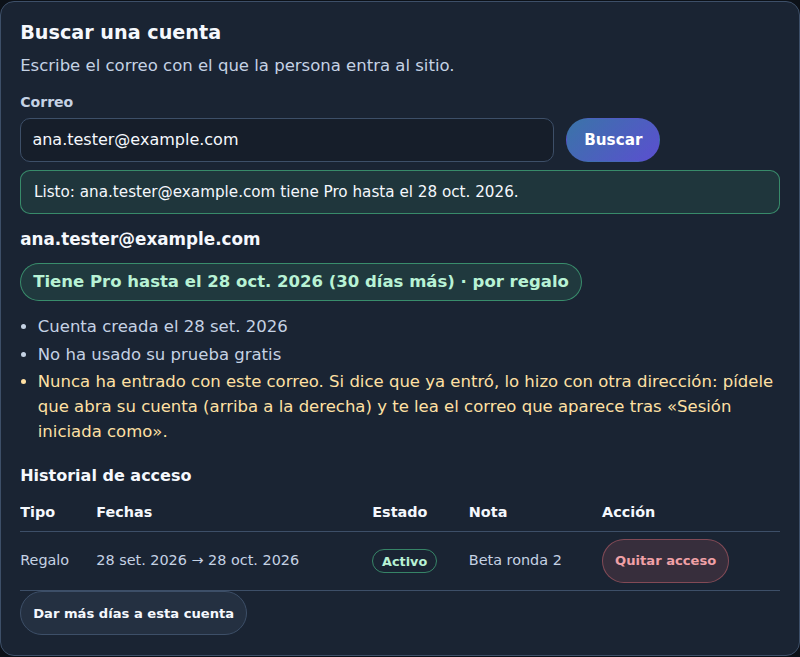

Things to know:

- **Days count from today**, not from when they first sign in.
- **The account does not need to exist yet.** Giving Pro creates it, and the
  person has Pro the moment they sign in with that address.
- **The address must be the one they sign in with.** For Gmail, dots and
  capital letters matter to this site even though Gmail ignores them:
  `ana.perez@gmail.com` and `anaperez@gmail.com` are two different accounts
  here. When in doubt, ask them to sign in first, tap their name at the top
  right and read you the address after **Sesión iniciada como** (Signed in
  as), then give Pro to that.

### Step 3. Tell them how to get in

Send them something like:

> Te di acceso Pro a Estudio Vocal. Entra en
> https://pillb.github.io/vocal-singing-training/ , toca **Entrar** (arriba a la
> derecha) y entra con Google usando **este mismo correo**. Si ya estabas
> dentro, recarga la página.

### Step 4. Check it worked

After they sign in, the top bar names what they have: an amber **REGALO**
(Gift) tag next to their name, and the **Pro** button now reads **Suscripción**
(Subscription). Their account panel (their name at the top right) says **Pro
de regalo · termina el …** (Gifted Pro · ends …). Go by the panel: it always
names the end date, while the top bar only names the kind of access. A free
trial shows **Prueba** (Trial) with the days left instead of REGALO.


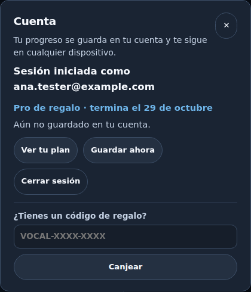

On your side, look them up again: the yellow "never signed in" line is replaced
by **Entra con Google · última vez …** (Signs in with Google · last seen …).

## 2. Remove Pro from someone

1. In **Buscar una cuenta** (Look up an account), type their address and press
   **Buscar** (Look up).
2. In **Historial de acceso** (Access history), find the row that is
   **Activo** (Active) and press **Quitar acceso** (Remove access) on it.
3. Your browser asks you to confirm, naming the person, what you are removing
   and its end date. If something else will keep them on Pro (another gift, a
   code, a subscription), it says so. Press **OK** / **Aceptar**. Press
   **Cancel** / **Cancelar** and nothing changes.

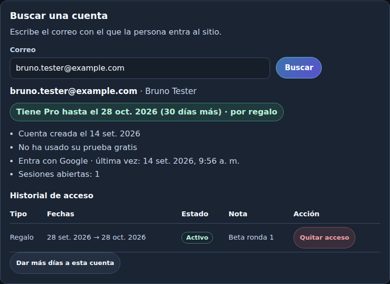

The page answers **Listo: se quitó el acceso** (Done: the access was removed),
the status turns to **Sin Pro ahora mismo** (No Pro right now), and the row
reads **Quitado el …** (Removed on …) with no button:

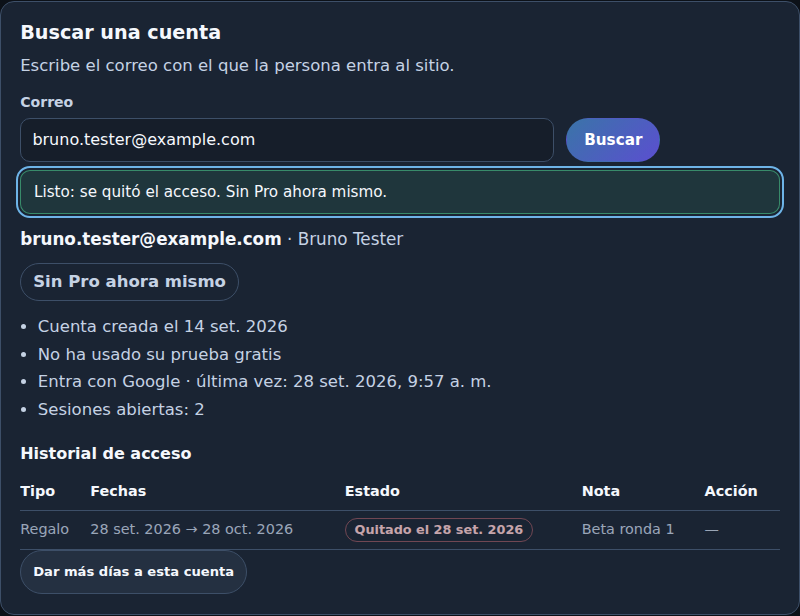

**When they notice:** the next time they open or reload the site, as soon as
the page hears back from the server. The REGALO tag goes, the button reads
**Pro** again, and their panel says **Plan gratis** (Free plan).

| Before | After their next reload |
|---|---|
|  |  |

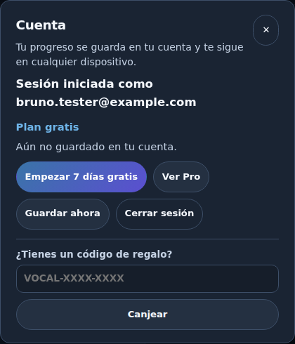

Two edge cases, both by design:

- A tab they never reload keeps Pro until it is reloaded.
- A phone with no connection keeps Pro until its licence expires, at most
  **3 days**. The licence is signed for 72 hours and the site cannot check
  anything while offline.

What removing does **not** do: it does not delete the account or their saved
progress, does not sign them out, and does not stop you giving Pro again later.

It does not use up their free trial either. If they never had one, their panel
now offers **Empezar 7 días gratis** (Start 7 days free), as in the picture
above, and they can take it once. Usually that is fine. To stop it, mark their
trial as used in the Mac terminal. Set their address as in
[8.0, step 4](#80-get-the-terminal-ready), then run this. **Changes data**, one
field on their account; the offer is gone on their next load:

```bash
npx --yes wrangler@4 d1 execute vocal-studio-accounts --remote --command "UPDATE accounts SET trial_used_at = unixepoch() WHERE email_normalized = lower(trim('$SQLEMAIL')) AND trial_used_at IS NULL"
```

The look-up then says **Ya usó su prueba gratis**.

**If they had more than one active or scheduled row** (a gift and a code, say),
remove each one. The confirmation warns you, and the status line tells you
whether any Pro is left.

**Removing a free trial** works the same way. The trial stays counted as used,
so they cannot start another one. Give them days instead if you change your
mind.

**Paid subscriptions** (once checkout opens) are not removed here. They show
under **Suscripciones pagadas** (Paid subscriptions) with no button, and are
cancelled in Mercado Pago or Stripe.

## 3. See what someone has

Type the address in **Buscar una cuenta** and press **Buscar**. You get:


- **The status pill**: green **Tiene Pro hasta el … (N días más) · por regalo**
  (Has Pro until … · N more days · from a gift), or grey **Sin Pro ahora mismo**.
  When several things overlap, this shows whichever lasts longest.
- **Cuenta creada el …** (Account created …).
- **Ya usó su prueba gratis** / **No ha usado su prueba gratis** (Has used /
  has not used the free trial): whether they have used their one free trial.
  New trials last 7 days. A trial started before the worker was redeployed
  with the 7-day change ([8.7](#87-redeploy-the-worker)) keeps its 30-day end
  date.
- **Entra con Google · última vez …** or, in yellow, **Nunca ha entrado con este
  correo**. **Sesiones abiertas** (Open sessions) counts browsers where they are
  signed in now. *These two lines appear once the worker has been redeployed
  with this change (section [8.7](#87-redeploy-the-worker)); before that the
  look-up simply leaves them out.*
- **Historial de acceso**: every trial, gift and comp they ever had, newest
  first. **Tipo** (Kind) is **Prueba gratis** (Free trial), **Regalo** (Gift) or
  **Cortesía** (Comp); a gift from a code says which code. **Estado** (Status)
  is **Activo**, **Programado** (Scheduled, not started yet), **Vencido**
  (Expired) or **Quitado el …** (Removed on …).

If nobody has that address, the page says so. Nobody has signed in with it and
nobody has given it Pro. **Dar más días a esta cuenta** (Give this account more
days) copies the address into the Give Pro form.

On a phone, each row of the table becomes a small card:

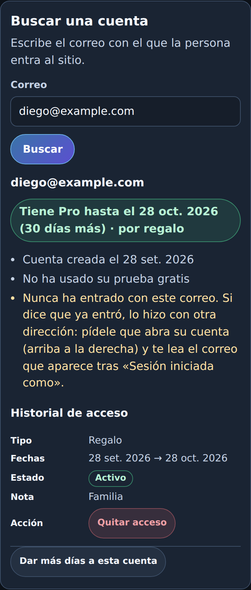

## 4. Give more days

Give Pro again (section [1, step 2](#step-2-give-pro-on-the-admin-page)).
Gifts do **not** add up: each one runs from today for its own number of days,
and the person has Pro until the latest end date among them.

- To extend someone who has 10 days left by a month, give **40** days, not 30.
- If you give fewer days than they already have, nothing changes, and the page
  tells you so: **ya tenía acceso hasta el …, así que su fecha final no cambia**
  (already had access until …, so their end date does not change).

## 5. Gift codes

A code is for when you don't know, or don't want to type, someone's address: a
group chat, a class, a raffle. Whoever types it gets the days, counted from
when they redeem it.

**Make one:**

1. In **Códigos de regalo** (Gift codes), set **Días** (Days) and **Usos**
   (Uses: how many different people can redeem it).
2. Optionally add a **Nota** (Note), such as "Coro del barrio". It is copied
   onto the gift of everyone who redeems the code, so each of them can ask to
   see it (8.14).
3. Press **Crear código** (Create code).
4. Press **Copiar mensaje para enviar** (Copy message to send) and paste it into
   WhatsApp or email. It carries the site's address, the steps and the code.
   **Copiar código** (Copy code) copies just the code.

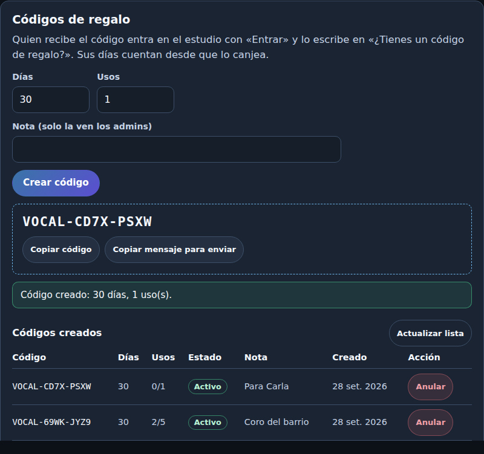

**How they redeem it:** they press **Entrar** (Sign in) at the top right and
sign in with Google. The same panel then shows **¿Tienes un código de regalo?**
(Have a gift code?): they type the code there and press **Canjear** (Redeem).
Someone already signed in taps their name at the top right to open that panel.
Dashes, spaces and small letters don't matter. The copied message walks them
through the same steps.

| Typing the code | Right after |
|---|---|
| 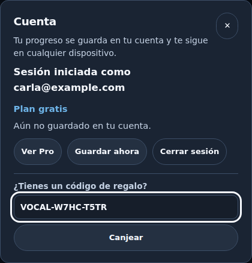 | 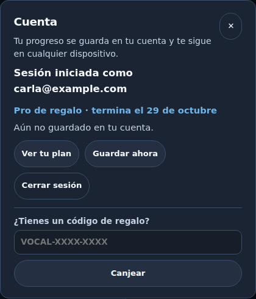 |

**The list of codes** shows, for each: days, uses (**2/5** means two of five
used), **Estado** and your note. **Activo** can still be redeemed; **Agotado**
(Used up) has no uses left; **Anulado** (Cancelled) was cancelled by an admin;
**Vencido** (Expired) has passed an expiry date.

**Cancel a code** with **Anular** (Cancel) and confirm. Nobody else can redeem
it. People who already redeemed it **keep their days**: to take those back,
look each person up and remove the row that says **con el código …**
(with code …).

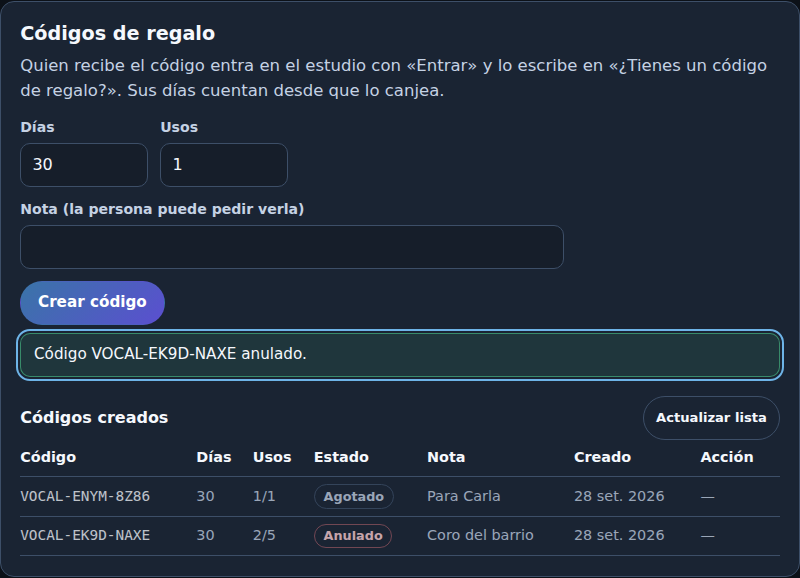

The list shows the latest 100 codes. **Actualizar lista** (Refresh list)
re-reads it, for example after another admin made a code.

## 6. Support answers

**"It says Access blocked" / "Acceso bloqueado: … no completó el proceso de
verificación de Google" / Error 403: access_denied.** Google is holding back an
address that is not on the test user list. Google's help says this site's kind
of sign-in is exempt, so this should not happen; if it does, add them as a
test user ([1, step 1](#step-1-can-their-google-account-sign-in-usually-yes-nothing-to-do)),
ask them to try again, and note in this guide that the exemption did not hold.

**"I signed in but I don't have Pro."**
1. Ask them to reload the page.
2. Ask them to tap their name at the top right and read you the address after
   **Sesión iniciada como** (Signed in as).
3. Look up **that** address. If it has no Pro, you probably gave Pro to a
   different spelling. Give it to this one, and remove the other if you like.
   Looking up the address you originally used will show **Nunca ha entrado con
   este correo**.

**"The Google button doesn't show."** The site says so itself when a blocker
stops Google's script: the panel reads **Este sitio entra con Google, y el
navegador no pudo cargarlo…** (This site signs in with Google, and the browser
could not load it…) above an **Intentar de nuevo** (Try again) button. Ask them
to allow the site in their ad blocker or privacy extension and press **Intentar
de nuevo**, or to try another browser.

**"Error 400: origin_mismatch" on Google's screen.** The site's address is
missing from the sign-in client's **Authorized JavaScript origins**. In Google
Cloud: **Google Auth Platform** → **Clients** → the web client → add
`https://pillb.github.io` (no path, no slash at the end) → **Save**. Google says
changes can take a few minutes to a few hours.

**"My free trial ended. Can I have another?"** The trial is once per account,
ever. Give them days instead (section [1, step 2](#step-2-give-pro-on-the-admin-page)).

**"I changed phones / my progress is gone."** Progress moves through the
account, so both devices must be signed in with the **same** address:

1. On the old device, if they still have it: open the account panel (their
   name at the top right), press **Guardar ahora** (Save now), and wait for
   **Progreso guardado en tu cuenta** (Progress saved to your account).
2. On the new device: sign in with the same address, press **Guardar ahora**
   there too, then reload the page.

Only the first practice profile moves, so it must be the one open on both
devices when they press **Guardar ahora**. What moves: practice history and
scores, practice days and streak, the 12-week plan, and goals. What stays on
each device: recordings, reminders, language, microphone settings, and any
other practice profile (Pro can have up to three).

**"A bar at the bottom asks me about statistics."** Only visitors in places
whose law says to ask first (the European Economic Area and a few territories)
see it: **Estadísticas anónimas** with **Aceptar** (Accept) and **Rechazar**
(Reject). Either answer is fine; practice, sign-in and Pro work the same. They
can change their mind any time at the foot of the page.

**"Delete my statistics" / "stop tracking me".** Statistics are not tied to
their account, so nothing in the account deletion reaches them. Ask them to
press **No enviar y borrar lo enviado** (Stop sending and delete what was sent)
at the foot of the practice site, in each browser they use. That deletes what
that browser sent and stops it sending more. If they can't, see the statistics
part of [8.5](#85-delete-someones-account-and-data).

**"What data do you have on me?"** The privacy page promises access,
correction and deletion. Section [8.14](#814-send-someone-the-data-we-hold)
shows how to send them what we hold.

If any of these arrive as a public GitHub issue, don't repeat their address in
your answer, edit it out of their message if they wrote it there, and carry on
privately (the private notes say how).

**"Delete my account."** Section [8.5](#85-delete-someones-account-and-data).

**"Someone else has my phone" / "sign me out everywhere".** Section
[8.6](#86-sign-someone-out-everywhere).

**"I paid and don't have Pro."** Checkout is not open yet, so nobody can have
paid. Once it is, see the payments runbook, [docs/34](34-PERU-OPERATOR-RUNBOOK.md).

## 7. Add or remove an admin

The admin list is a secret called `ADMIN_EMAILS` on the worker: addresses
separated by commas. It is not in this repository, because the repository is
public.

**Change the list.** This replaces the whole list, so type every address that
should be an admin afterwards, yourself included.

1. Open Terminal on the Mac and get ready as in [8.0](#80-get-the-terminal-ready).
2. Run:

   ```bash
   npx --yes wrangler@4 secret put ADMIN_EMAILS
   ```

3. At **Enter a secret value:** type or paste the full list, separated by
   commas and nothing else, for example
   `first.admin@gmail.com,second.admin@gmail.com`, then press Enter. The
   terminal may not show what you type.
4. Wrangler answers that it uploaded the secret. It takes effect straight away;
   there is nothing else to deploy.

What happens next:

- **Someone removed** is refused on their very next action on the admin page
  (**Tu cuenta ya no es administradora**, Your account is no longer an admin),
  and sees the "not an admin" page when they reload. Their own account, Pro and
  progress are untouched.
- **Everyone on the list can also read the statistics** ([8.13](#813-read-the-statistics)).
- **Someone added** opens the admin page, signs in, and has the tools. The
  **Abrir el panel de admin** link in their **Cuenta** panel appears once the
  worker has been redeployed with this change ([8.7](#87-redeploy-the-worker));
  until then they open the admin page by its address.

**Nobody can read the list back**, not even Cloudflare's dashboard:
`npx --yes wrangler@4 secret list` shows only the name `ADMIN_EMAILS`. If you
are not sure what it holds, set it again with the list you want.

Both steps were tried on a local copy of the worker: the page switched from
admin to "not an admin" on the next action, with no redeploy.

## 8. Maintenance

The admin page covers the everyday checks. The rest runs in a terminal on the
Mac, from the `workers/entitlements` folder of the checkout where
`scripts/setup.sh` was run. That checkout matters: its `wrangler.toml` holds
the real database id, while the copy on GitHub has placeholders on purpose.

### 8.0 Get the terminal ready

Do this once each time you open a new Terminal window for maintenance.

**1. Go to the right folder.** The path of the checkout is in the private notes.

```bash
cd PATH-TO-THE-CHECKOUT/workers/entitlements
grep -E '^(id|preview_id|database_id) *=' wrangler.toml
```

The second command must print long ids. If it prints `TODO_REPLACE…`, you are
in a copy that was never set up: stop, and find the checkout the private notes
name.

**2. Sign in to Cloudflare**, one of two ways:

- **Wrangler login** (simplest for occasional jobs). Run
  `npx --yes wrangler@4 login`, approve in the browser window it opens, then
  `npx --yes wrangler@4 whoami` to see the account. It stays signed in on
  that Mac until you run `npx --yes wrangler@4 logout`.
- **An API token for this session only.** In the Cloudflare dashboard: your
  profile icon → **My Profile** → **API Tokens** → **Create Token** → **Create
  Custom Token**, with three account permissions: **Workers Scripts: Edit**,
  **Workers KV Storage: Edit**, **D1: Edit**. Copy it, then in Terminal:

  ```bash
  read -rs CLOUDFLARE_API_TOKEN
  ```

  Paste the token and press Enter (nothing shows; that is on purpose, so it
  never lands in the terminal's history). Then:

  ```bash
  export CLOUDFLARE_API_TOKEN
  export CLOUDFLARE_ACCOUNT_ID='THE-ACCOUNT-ID'
  ```

  The account id is on the dashboard's account home, in the right-hand
  column. When you finish, close the window and delete the token in **API
  Tokens**. A token left in the environment wins over a wrangler login, so
  don't mix the two in one window.

**3. Terminal habits that avoid surprises** on the Mac's default shell (zsh):
paste one command at a time; don't paste lines that start with `#`; and never
put `!` inside double quotes, because zsh treats it as a history command.

**4. Setting someone's address**, for the commands that act on one person.
The address comes from a message, so never type it into a command yourself;
let the terminal read it:

```bash
read -r EMAIL
```

Paste or type the address exactly as they sign in, and press Enter. Then:

```bash
SQLEMAIL=${EMAIL//\'/\'\'}; echo "[$EMAIL]"
```

It prints the address between brackets; check it is the one you meant. The
commands below use `$SQLEMAIL`, which is the same address made safe to put in
the database's commands (an apostrophe, as in o'neil@…, would otherwise break
them). Both last until you close the window.

Every command below was run in an interactive zsh against a local copy of the
database (`--local` in place of `--remote`) with made-up people, and its
output checked. Commands that change data say so in bold.

### 8.1 Is the server healthy?

On the admin page, **Mantenimiento** → **Estado del servidor** (Server status):

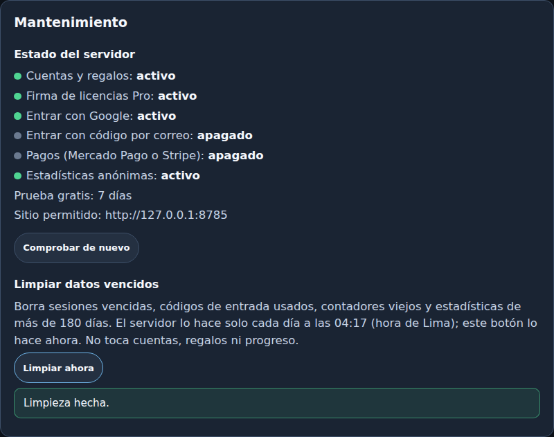

On the live site you should see green for **Cuentas y regalos** (Accounts and
gifts), **Firma de licencias Pro** (Pro licence signing), **Entrar con Google**
(Sign in with Google) and **Estadísticas anónimas** (Anonymous statistics), then
**Prueba gratis: 7 días** (Free trial: 7 days) and **Sitio permitido** (Allowed
site) `https://pillb.github.io`. Email codes and payments are off until those
stages of the runbook are done. (The screenshot is from the sandbox, so its
allowed site is a local address.)

Two lines also tell you which build of the worker is live:

- **Estadísticas anónimas: no informado** (not reported), in red, or **Prueba
  gratis: 30 días**: the worker predates the statistics and the 7-day trial.
  Redeploy it ([8.7](#87-redeploy-the-worker)).
- **Estadísticas anónimas: apagado** (off): the statistics kill switch is on
  ([8.11](#811-limits-worth-knowing)).

From any terminal, without signing in to anything:

```bash
curl -sS https://vocal-studio-entitlements.vocalstudio-pe.workers.dev/v1/health
```

Healthy looks like `"ok":true`, `"signingKeyConfigured":true`,
`"accountsConfigured":true`, `"eventsEnabled":true`, `"google":true`,
`"trialDays":7` and `"siteOrigin":"https://pillb.github.io"`. `"email":false`
and the payment fields are `false` until those stages are set up. No
`eventsEnabled` at all, or `"trialDays":30`, means an older build is live (see
above). No answer at all means the worker is down or unreachable: see
[8.9](#89-read-the-servers-logs).

### 8.2 Clean up expired data

**Mantenimiento** → **Limpiar ahora** (Clean up now) deletes expired sessions,
used sign-in codes, old rate-limit counters, and statistics older than 180 days
(the privacy page promises that limit). It never touches accounts, gifts or
progress, so it is safe to press any time.

Once the worker is redeployed with the daily clean-up
([8.7](#87-redeploy-the-worker)), the server runs the same thing by itself
every day at 09:17 UTC (04:17 in Lima), so the button is only for "now". Until
then, press it every few weeks.

### 8.3 Who has Pro right now

In the Mac terminal ([8.0](#80-get-the-terminal-ready)), read-only:

```bash
npx --yes wrangler@4 d1 execute vocal-studio-accounts --remote --command "SELECT a.email, g.kind, g.note, datetime(g.ends_at, 'unixepoch') AS ends_utc FROM grants g JOIN accounts a ON a.id = g.account_id WHERE g.revoked_at IS NULL AND g.starts_at <= unixepoch() AND g.ends_at > unixepoch() ORDER BY g.ends_at"
```

One row per running trial, gift or comp, soonest to end first. Times are UTC
(Lima is 5 hours behind). Paid subscriptions are not in this list; once
checkout opens, this lists which account each paid licence belongs to:

```bash
npx --yes wrangler@4 d1 execute vocal-studio-accounts --remote --command "SELECT a.email, l.license_id, l.provider, datetime(l.created_at, 'unixepoch') AS linked_utc FROM license_links l JOIN accounts a ON a.id = l.account_id ORDER BY l.created_at DESC"
```

### 8.4 Everyone with an account

Read-only. One row per account: when it was made, when it was last used,
how they sign in (`NEVER` means an address given Pro that has never signed
in), and whether the trial was used.

```bash
npx --yes wrangler@4 d1 execute vocal-studio-accounts --remote --command "SELECT a.email, datetime(a.created_at, 'unixepoch') AS created_utc, (SELECT datetime(MAX(s.last_seen_at), 'unixepoch') FROM sessions s WHERE s.account_id = a.id) AS last_seen_utc, COALESCE((SELECT group_concat(DISTINCT i.provider) FROM identities i WHERE i.account_id = a.id), 'NEVER') AS signed_in_with, CASE WHEN a.trial_used_at IS NULL THEN 'no' ELSE date(a.trial_used_at, 'unixepoch') END AS trial_used FROM accounts a ORDER BY a.created_at"
```

For one person, the admin page's look-up shows the same and more.

### 8.5 Delete someone's account and data

When someone asks for their data to be deleted (Peru's personal data law, Ley
29733, gives them that right), this removes their account, sessions, sign-in
records, gifts and trial, code redemptions, saved progress and counters.

**Only act for the owner of the address.** Requests may arrive from anywhere
(a GitHub issue, another address). Write to the address itself and go ahead
only once they confirm from it.

**This cannot be undone from the page or the terminal.** Take a backup first
([8.8](#88-back-up-the-accounts-database)); within the time-travel window a
point-in-time restore can also bring it back, but that rolls back
**everyone's** changes since then.

1. Set the address as in [8.0, step 4](#80-get-the-terminal-ready).
2. Look them up, to be sure it is the right account (read-only):

   ```bash
   npx --yes wrangler@4 d1 execute vocal-studio-accounts --remote --command "SELECT id, email, datetime(created_at, 'unixepoch') AS created_utc FROM accounts WHERE email_normalized = lower(trim('$SQLEMAIL'))"
   ```

   Write today's date and the **id** (it starts with `acct_`) in your private
   deletion log, never the address. No row means no account has that
   address: stop.
3. **Delete** (one command, all on one line):

   ```bash
   npx --yes wrangler@4 d1 execute vocal-studio-accounts --remote --command "DELETE FROM progress WHERE account_id = (SELECT id FROM accounts WHERE email_normalized = lower(trim('$SQLEMAIL'))); DELETE FROM sessions WHERE account_id = (SELECT id FROM accounts WHERE email_normalized = lower(trim('$SQLEMAIL'))); DELETE FROM identities WHERE account_id = (SELECT id FROM accounts WHERE email_normalized = lower(trim('$SQLEMAIL'))); DELETE FROM gift_redemptions WHERE account_id = (SELECT id FROM accounts WHERE email_normalized = lower(trim('$SQLEMAIL'))); DELETE FROM grants WHERE account_id = (SELECT id FROM accounts WHERE email_normalized = lower(trim('$SQLEMAIL'))); DELETE FROM license_links WHERE account_id = (SELECT id FROM accounts WHERE email_normalized = lower(trim('$SQLEMAIL'))); DELETE FROM rate_limits WHERE bucket = 'login:email:' || lower(trim('$SQLEMAIL')) OR bucket IN (SELECT 'redeem:acct:' || id FROM accounts WHERE email_normalized = lower(trim('$SQLEMAIL')) UNION SELECT 'progress:acct:' || id FROM accounts WHERE email_normalized = lower(trim('$SQLEMAIL'))); DELETE FROM login_codes WHERE email_normalized = lower(trim('$SQLEMAIL')); DELETE FROM accounts WHERE email_normalized = lower(trim('$SQLEMAIL'))"
   ```

   It ends with **9 commands executed successfully**. A typo in the address
   deletes nothing; look them up again to confirm the account is gone.

Worth knowing:

- **Paid licences** (once checkout opens) also live in a separate store. Run
  the paid-licence query in 8.3 before deleting, note their licence id, and
  after deleting run
  `npx --yes wrangler@4 kv key delete "lic:LICENCE-ID" --binding ENTITLEMENTS --preview false --remote`.
  The payment provider keeps its own records; cancel there first.
- **Their own devices** still hold whatever the browser saved (local progress,
  recordings). Tell them to clear the site's data in their browser, or it
  will simply sit there unused.
- If they sign in again later, they get a new, empty account, and can take a
  free trial again.
- **Statistics are not tied to the account**, by design, so the command above
  cannot reach them. Ask them to press **No enviar y borrar lo enviado** at the
  foot of the practice site in each browser they use, **before** clearing the
  site's data: that deletes everything that browser sent. If they can't (the
  browser is gone), nothing else identifies their statistics, and they are
  deleted after 180 days anyway. If they can still open the browser but the
  button doesn't work for them, they can send you its browser id instead: in
  that browser, on the practice site, the id is
  `VTExperiments.report().clientId` in the developer console. Let the terminal
  read it (paste it, press Enter):

  ```bash
  read -r CID
  ```

  Then check it looks like one before using it:

  ```bash
  print -r -- "$CID" | grep -Eqx '[0-9a-z]{8,32}' && echo "looks right" || echo "not a browser id: stop"
  ```

  Only if it says **looks right**, **delete** (one line):

  ```bash
  npx --yes wrangler@4 d1 execute vocal-studio-accounts --remote --command "DELETE FROM events WHERE cid = '$CID'; DELETE FROM exposures WHERE cid = '$CID'; DELETE FROM rate_limits WHERE bucket = 'evc:$CID'"
  ```

  It ends with **3 commands executed successfully**. This is what the button
  does on the server.
- **Sign-in limit counters** are keyed by the network address a sign-in came
  from (to stop sign-in and code guessing), not by the account, so the command
  above leaves them; once the daily clean-up runs (8.7) they go within two
  days.
- The deletion log (step 2) is what lets you delete them again if a backup is
  ever restored ([8.8](#88-back-up-the-accounts-database)).

### 8.6 Sign someone out everywhere

For a lost phone, or "someone else is using my account". **Changes data**, but
only ends sessions: their account, Pro and progress stay. Set the address as
in [8.0, step 4](#80-get-the-terminal-ready), then:

```bash
npx --yes wrangler@4 d1 execute vocal-studio-accounts --remote --command "UPDATE sessions SET revoked_at = unixepoch() WHERE revoked_at IS NULL AND account_id = (SELECT id FROM accounts WHERE email_normalized = lower(trim('$SQLEMAIL')))"
```

Every browser where they were signed in drops the session the next time it
opens or reloads the site, and shows Pro again only after they sign in. After
the worker has been redeployed ([8.7](#87-redeploy-the-worker)), the admin
page's look-up shows **Sesiones abiertas: 0** (Open sessions: 0).

### 8.7 Redeploy the worker

Needed only when a change to `workers/entitlements` is merged. The site itself
redeploys on its own when `main` changes; the worker does not.

**The first redeploy after the statistics and 7-day-trial changes** (September
2026) turns on several things at once. Do it the same day those changes reach
`main`, because until then the site asks the worker for routes it does not
have yet:

- The look-up's sign-in lines (**Entra con Google · última vez …**) and
  **Sesiones abiertas**.
- New trials last 7 days. Trials already running keep their end date.
- Anonymous statistics start being stored, with the delete switch and the
  Europe consent check. The three tables they need are created on the first
  request; there is no migration step.
- The **Estadísticas** section of the admin page starts answering.
- The daily clean-up at 09:17 UTC ([8.2](#82-clean-up-expired-data)).

1. Get ready as in [8.0](#80-get-the-terminal-ready), and write down what is
   live now, so you can go back to it (8.10):

   ```bash
   npx --yes wrangler@4 deployments list
   ```

   The newest entry's **Version ID** goes in the private notes.
2. Get the latest code:

   ```bash
   git checkout main
   git pull
   ```

   If git refuses because `wrangler.toml` has local changes, run `git stash`,
   then `git pull`, then `git stash pop`. Those local changes are the real ids;
   never commit them.
3. Check the ids again (the `grep` in 8.0), then deploy:

   ```bash
   npx --yes wrangler@4 deploy
   ```

   It lists the bindings (the database and store should show real ids, not
   `TODO_REPLACE`), then prints the worker's address, the daily schedule
   `17 9 * * *`, and a new **Version ID**. Note that id too.
4. Check health (8.1: **Estadísticas anónimas: activo**, **Prueba gratis: 7
   días**), look someone up on the admin page, and press **Leer estadísticas**
   (8.13).

**Optional, once:** give the statistics their own key for the per-network
counters, instead of one derived from the licence signing key. Run
`openssl rand -base64 32`, then `npx --yes wrangler@4 secret put EVENTS_IP_KEY`
and paste what the first command printed. Nothing needs to keep it: if it is
ever lost, set a new one, which only restarts those counters.

Deploying keeps every secret, the database and the store as they are: admins,
the signing key and everyone's Pro are unaffected. `scripts/setup.sh` also
deploys and is safe to re-run, but **run it without `ADMIN_EMAIL` set**: given
that variable it replaces the whole admin list with that one address. Never
pass it `--rotate-key` unless the private key leaked, because every Pro
licence stops verifying until the site ships the new public key.

### 8.8 Back up the accounts database

The backup holds the account tables only: accounts, sign-ins, sessions, gifts
and codes, paid-licence links and saved progress. It leaves out the anonymous
statistics and the per-network counters on purpose, because the privacy page
promises those are gone after 180 days and two days, and a backup would keep
them longer. It still holds everyone's email, so keep it off GitHub and out
of this folder. Read-only on the server; the second command is one line:

```bash
mkdir -p ~/vocal-backups
```

```bash
npx --yes wrangler@4 d1 export vocal-studio-accounts --remote --table schema_meta --table accounts --table identities --table sessions --table grants --table gift_codes --table gift_redemptions --table license_links --table progress --output ~/vocal-backups/accounts-$(date +%Y%m%d).sql
```

Delete old backups now and then; this removes those older than 30 days:

```bash
find ~/vocal-backups -name 'accounts-*.sql' -mtime +30 -delete
```

A backup restores only into an **empty** database (its tables are created
without "if not exists"), with
`npx --yes wrangler@4 d1 execute DATABASE-NAME --remote --file BACKUP.sql`.
The worker creates the statistics tables again, empty, on its next request.
That was tried locally: every restored table's row count matched, and the
statistics tables came back empty and working.

A restore also brings back anyone deleted since the backup was taken. Delete
them again from your deletion log (8.5): for each id dated after the backup,
let the terminal read it (paste it, press Enter)

```bash
read -r ID
```

check it,

```bash
print -r -- "$ID" | grep -Eqx 'acct_[A-Za-z0-9_-]{22}' && echo "looks right" || echo "not an account id: stop"
```

and only if it says **looks right**, **delete** (one line; it ends with **8
commands executed successfully**):

```bash
npx --yes wrangler@4 d1 execute vocal-studio-accounts --remote --command "DELETE FROM progress WHERE account_id = '$ID'; DELETE FROM sessions WHERE account_id = '$ID'; DELETE FROM identities WHERE account_id = '$ID'; DELETE FROM gift_redemptions WHERE account_id = '$ID'; DELETE FROM grants WHERE account_id = '$ID'; DELETE FROM license_links WHERE account_id = '$ID'; DELETE FROM rate_limits WHERE bucket IN ('redeem:acct:$ID', 'progress:acct:$ID'); DELETE FROM accounts WHERE id = '$ID'"
```

For "undo the last few hours", point-in-time restore is simpler. It works on
the live database only, and rolls back **everything** since the chosen moment,
statistics included: anything deleted since then comes back, including what
people deleted with **No enviar y borrar lo enviado**, and nothing records
which browsers those were. Use it only for a real emergency, then apply your
deletion log again as above. It reaches back up to 30 days, possibly fewer on
the free plan (not checked here; `time-travel info` shows whether a moment is
still reachable):

```bash
npx --yes wrangler@4 d1 time-travel info vocal-studio-accounts --timestamp 2026-09-24T12:00:00Z
npx --yes wrangler@4 d1 time-travel restore vocal-studio-accounts --timestamp 2026-09-24T12:00:00Z
```

(Only the commands' help was checked for time travel; it cannot run on a
local copy.)

### 8.9 Read the server's logs

Live, while someone reproduces a problem (Ctrl+C stops it):

```bash
npx --yes wrangler@4 tail vocal-studio-entitlements --format pretty
```

It shows every request, and every visitor's browser now calls the worker
(statistics, the region check), so start it just before the problem is
reproduced. When the problem is on your own computer, add `--ip self` to see
only your requests. When something breaks inside the worker it writes
**unhandled error** and the reason, and answers 500; Cloudflare does not
count that as an error, so don't add `--status error`, which would hide it.
Past logs are in the Cloudflare dashboard, on the worker's page (logging is
switched on in `wrangler.toml`). The worker's own log lines never include request bodies,
tokens or secrets, but Cloudflare's request records include each address
called, and a look-up's address carries the email, so treat logs as private.
What else Cloudflare records about each request was not checked here; look
before quoting the privacy page's "no IP address is stored" about logs.

### 8.10 Undo a bad deploy

```bash
npx --yes wrangler@4 deployments list
npx --yes wrangler@4 rollback VERSION-ID -m "why"
```

A rollback restores the code, and may restore the secrets that version had, so
check the admin list (section 7) afterwards. It does **not** roll back the
database or the licence store.

**Don't roll back past the statistics redeploy** (8.7) unless something is
badly broken. The older code has no daily clean-up, and its **Limpiar ahora**
does not delete statistics, so the 180-day promise would break; the site's
statistics requests would all fail; and new trials would go back to 30 days.
If you must, run this every few days until you deploy forward again (one line;
**changes data**, deleting only statistics older than 180 days):

```bash
npx --yes wrangler@4 d1 execute vocal-studio-accounts --remote --command "DELETE FROM events WHERE received_at < unixepoch() - 15552000; DELETE FROM exposures WHERE first_at < unixepoch() - 15552000; DELETE FROM ingest_daily WHERE day < date('now', '-180 days')"
```

### 8.11 Limits worth knowing

- The worker runs on Cloudflare's free plan: 100,000 requests a day and 10 ms of
  CPU per request. Signing a licence is the heaviest step. If sign-in starts
  failing with errors under load, the fix is the $5-a-month Workers plan, not a
  code change.
- **Statistics share the database with accounts.** The free plan allows
  100,000 rows written a day. A browser sends about 65 statistics requests an
  hour of practice, each writing a few rows (an estimate from the code, not
  measured), so a few hundred hours of practice a day fit. If the database
  runs out of writes, sign-in, gifts and progress saving fail too, not just
  statistics. The database's page in the Cloudflare dashboard shows rows
  written per day.
- **The statistics kill switch:** in the Mac checkout's
  `workers/entitlements/wrangler.toml`, change `EVENTS_ENABLED = "true"` to
  `"false"` and deploy (8.7). The worker then stores nothing and writes no
  counters for statistics, and health shows **Estadísticas anónimas:
  apagado**. Browsers keep sending until the site stops too, which is a
  change to `js/experiments-config.js`; the requests are cheap because they
  are refused before anything is written. Set it back to `"true"` and deploy
  to resume. **Never commit from the Mac checkout**: its `wrangler.toml` holds
  the real ids. To make a switch-off permanent, change it in a pull request
  from a clean copy of the repository.
- The codes list on the admin page shows the latest 100 codes.
- Look-ups show up to 200 history rows per person.

### 8.12 Take Google sign-in out of Testing (optional)

If the test-user exemption in section 1 ever turns out not to hold, publishing
the sign-in removes the test-user list altogether: Google Cloud → **Google Auth
Platform** → **Audience** → **Publish app** → **Confirm**. Google's help says
an app that asks only for name and email address does not need Google's
verification for this. Not tried here yet.

### 8.13 Read the statistics

**Estadísticas** (Statistics) on the admin page shows how many people get from
one step to the next when signing in and trying Pro. Choose a period (7, 28,
90 or 180 days; 28 is chosen to start) and press **Leer estadísticas** (Read
statistics). Nothing is read until you press it; after that, pressing another
period reads it straight away. Reading from this page adds nothing to the
numbers. If the kill switch is on (8.11), the section says so at the top. (The same funnel is in the practice site's account
panel under **Embudo de cuentas**, but opening that panel counts you as a
visitor.)

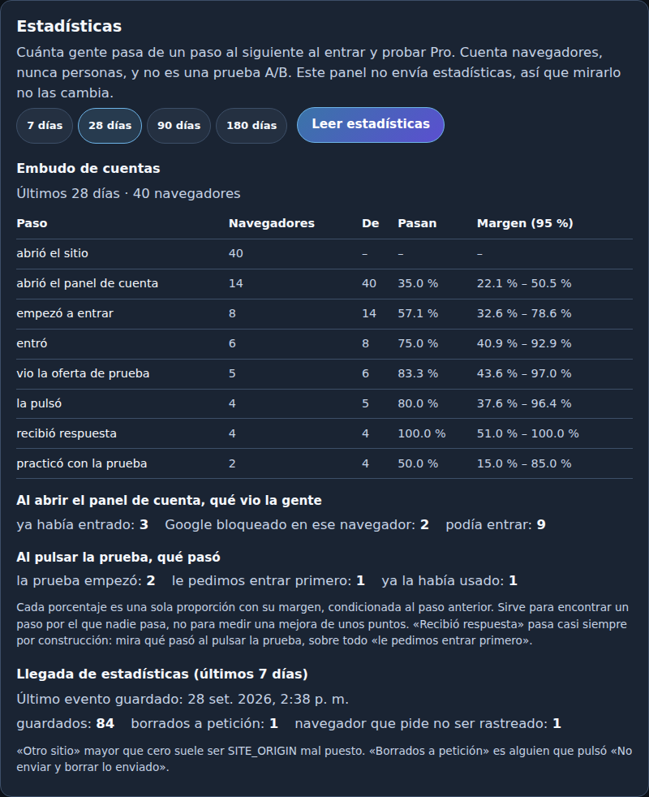

How to read it:

- **It counts browsers, not people.** Someone on a phone and a laptop is two
  browsers. Nothing here is tied to an account, which is also why a person's
  statistics cannot be found by their email.
- **Each row is conditional on the one above:** of the browsers that opened
  the account panel, how many started signing in, and so on. Each row looks
  only at the step above it, not at the whole path: the trial can also be
  pressed from the Pro window without signing in, so a row's **De** (Of) can
  be larger than the row above's **Navegadores**, and the rates don't multiply
  into one overall rate. The **Margen (95
  %)** column is the honest range for that rate. With a few dozen browsers the
  range is wide, so use this to spot a step **nobody** gets through, not to
  judge a change of a few points. It is not an A/B test.
- **Recibió respuesta** (Got an answer) is near 100% by design, because every
  press of a trial button ends in an answer. The line to read is under **Al
  pulsar la prueba, qué pasó** (What happened when people pressed the trial):
  **le pedimos entrar primero** (we asked them to sign in first) is a press
  that worked and still started no trial.
- **Al abrir el panel de cuenta, qué vio la gente** (What people saw when the
  account panel opened): **Google bloqueado en ese navegador** (Google blocked
  in that browser) counts people who could not have signed in however they
  tried.
- **Not counted at all:** browsers that send Global Privacy Control, browsers
  whose owner pressed **No enviar y borrar lo enviado**, automated browsers,
  and visitors in the European Economic Area who have not pressed **Aceptar**
  on the statistics bar. Your own test browsers, if you switched them off as
  in section 0.

**Llegada de estadísticas** (Statistics arriving) is the last week's counters:

- **guardados** (stored): events kept as they arrived. Zero for days while
  people are using the site means something is broken. A later deletion does
  not lower it, so it can sit a little above what the funnel still holds (in
  the picture, 84 arrived and one browser then deleted its one event).
- **otro sitio** (another site) above zero usually means `SITE_ORIGIN` in
  `wrangler.toml` doesn't match the site's address. It shows in red.
- **demasiados seguidos** (too many at once), also red: a browser or a shared
  network hit its hourly limit.
- **borrados a petición** (deleted on request): how many times someone
  pressed the delete switch, not how many events it removed. **sin permiso (Europa)** (no consent, Europe): a batch from the EEA
  without consent, refused as it should be. **navegador que pide no ser
  rastreado** and **navegadores automáticos**: refused on purpose.
- **descartados por mal formados** (dropped as malformed): mostly events the
  worker does not know yet, which happens when the site was updated and the
  worker was not. A steady stream after a merge means the worker needs its
  redeploy (8.7); a stray few are harmless.

If the section says the server doesn't have this yet, the worker needs its
redeploy (8.7).

**A rule for anyone reading raw tables:** never look up `events` or
`exposures` together with account tables, or around the time of one person's
sign-in. With so few visitors, matching times can point to a person, which is
exactly what keeping them apart is meant to prevent.

### 8.14 Send someone the data we hold

The privacy page promises people access to what we keep about them. This
collects it into one file on the Mac, **read-only**. As with deleting, **only
act for the owner of the address**: send the file only by email to that same
address, never to another one or to the place the request came from.

Set the address as in [8.0, step 4](#80-get-the-terminal-ready). Then make a
folder for the file, and run the export (one line):

```bash
mkdir -p ~/vocal-exports
```

```bash
npx --yes wrangler@4 d1 execute vocal-studio-accounts --remote --json --command "SELECT email, display_name, locale, role, datetime(created_at, 'unixepoch') AS created_utc, datetime(trial_used_at, 'unixepoch') AS trial_used_utc FROM accounts WHERE email_normalized = lower(trim('$SQLEMAIL')); SELECT provider, subject, datetime(created_at, 'unixepoch') AS since_utc FROM identities WHERE account_id = (SELECT id FROM accounts WHERE email_normalized = lower(trim('$SQLEMAIL'))); SELECT datetime(created_at, 'unixepoch') AS signed_in_utc, datetime(last_seen_at, 'unixepoch') AS last_seen_utc, datetime(revoked_at, 'unixepoch') AS signed_out_utc FROM sessions WHERE account_id = (SELECT id FROM accounts WHERE email_normalized = lower(trim('$SQLEMAIL'))); SELECT kind, plan, datetime(starts_at, 'unixepoch') AS starts_utc, datetime(ends_at, 'unixepoch') AS ends_utc, source, note, datetime(revoked_at, 'unixepoch') AS removed_utc FROM grants WHERE account_id = (SELECT id FROM accounts WHERE email_normalized = lower(trim('$SQLEMAIL'))); SELECT code_normalized AS code, datetime(created_at, 'unixepoch') AS redeemed_utc FROM gift_redemptions WHERE account_id = (SELECT id FROM accounts WHERE email_normalized = lower(trim('$SQLEMAIL'))); SELECT license_id, provider, datetime(created_at, 'unixepoch') AS linked_utc FROM license_links WHERE account_id = (SELECT id FROM accounts WHERE email_normalized = lower(trim('$SQLEMAIL'))); SELECT profile_id, datetime(updated_at, 'unixepoch') AS saved_utc, doc FROM progress WHERE account_id = (SELECT id FROM accounts WHERE email_normalized = lower(trim('$SQLEMAIL')))" > ~/vocal-exports/export-$(date +%Y%m%d-%H%M).json
```

The file (in the `vocal-exports` folder of your home folder) holds seven
lists, in this order: the account, how they sign in (`subject` is Google's id
for them), their sign-ins, their trials and gifts (with the admin notes: those
are about them, so they get them too), codes they redeemed, paid licences, and
their saved progress. Times are UTC. An empty list means nothing of that kind.
Check the first list shows the right address before sending the file, send it
privately, then delete it from the Mac.

It leaves out on purpose: which admin gave or removed a gift (that is the
admin's data), and session keys. Statistics are not in it because they are not
tied to the account (8.13). If they want those too, they send you the browser
id as in 8.5; read and check it the way 8.5 does, then (one line, read-only):

```bash
npx --yes wrangler@4 d1 execute vocal-studio-accounts --remote --json --command "SELECT name, day, tz, datetime(received_at, 'unixepoch') AS utc, props FROM events WHERE cid = '$CID'; SELECT experiment, variant, day, datetime(first_at, 'unixepoch') AS first_utc FROM exposures WHERE cid = '$CID'" > ~/vocal-exports/stats-$(date +%Y%m%d-%H%M).json
```

That file holds two lists: the events that browser sent, and which version of
any test it was shown.

## 9. Practise in the sandbox

The sandbox is a private copy of the site and its server on your own computer,
with made-up people in it. Nothing you do there reaches anyone.

```bash
node qa/admin/sandbox.mjs
```

Then open http://127.0.0.1:8780/__sandbox/ and choose who to be:

| Person | Starts as |
|---|---|
| `admin@example.com` | An admin |
| `ana.tester@example.com` | A new tester, no Pro |
| `bruno.tester@example.com` | A tester with a gifted month |
| `carla@example.com` | Used her free trial, which has ended |
| `diego@example.com` | Given Pro, has not signed in yet |

The server is the real worker code on a real SQLite database kept in memory;
stopping the script (Ctrl+C) forgets everything. It starts with forty made-up
browsers' statistics, so **Estadísticas** has something to show. The one thing it cannot do is
Google: "sign in as" writes the same session the Google route writes once
Google has confirmed who someone is. It needs Node 22 or newer and nothing
else.

**Retaking the screenshots** after the account panel or the admin page
changes (the first command is needed once per computer):

```bash
npx playwright install chromium
node qa/admin/capture-guide-shots.mjs
```

It walks through every procedure above and rewrites `docs/admin-guide/*.png`.

## 10. What admins can't do from the page, by design

- **Edit or shorten a gift.** Remove it and give a new one.
- **See progress or recordings.** Recordings never leave the person's device.
- **Change someone's address.** A new address is a new account; give Pro to
  the new one and remove it from the old.
- **Refund or cancel a payment.** That happens in Mercado Pago or Stripe.

## 11. How this guide was tested

Three layers, from most to least automatic:

1. **Browser tests** in `tests/admin.spec.js` drive the real admin page and the
   real practice site in Chromium against the real worker code on a real
   SQLite database. Nothing is mocked except Google. Run them with
   `npx playwright test tests/admin.spec.js`.
2. **The sandbox** (section 9) and `qa/admin/capture-guide-shots.mjs` walked
   every procedure with made-up people; the screenshots here are from that run.
3. **Terminal commands** in sections 7 and 8 ran in an interactive zsh against
   a local copy of the database with the same wrangler version the Mac uses.

| Procedure | Browser test | Terminal |
|---|---|---|
| Sign in; non-admins see nothing | signed out: offers admin sign-in… · a member who is not on ADMIN_EMAILS… · an account server that is down reads as down… | |
| 1. Give a tester Pro | give Pro to a tester who has not signed in yet… · give Pro refuses a bad address… · a gift whose answer is lost… | |
| 2. Remove Pro | remove Pro: the tester loses it on their next load · removing one of two gifts warns… · remove a free trial… · blocking the free trial after removing a gift… | trial block, local |
| 3. See what someone has | look up an address nobody has used… · notes and names are shown as text… | |
| 4. More days | give more days: a shorter gift never shortens access… | |
| 5. Gift codes | gift codes: create, redeem, used up, cancel · cancelling a code does not take days… | |
| 7. Admin list | an admin taken off ADMIN_EMAILS is refused at once… · an admin added… after first signing in… | `secret put`, local |
| 8.1–8.2 Health, clean-up | maintenance: server status and clean-up · maintenance: an old worker's missing statistics field… | `curl` shape checked against the code |
| 8.3–8.6 Lists, delete, sign out everywhere | a session that ends mid-use returns to sign-in… | each query, local, with the address read by `read -r` (an apostrophe included), and deleting one browser's statistics |
| 8.7–8.10 Deploy, backup, logs, rollback | the sandbox's trial length is the one wrangler.toml deploys · admin.html loads the same versions… | build checked with `deploy --dry-run`; account-only export, restore and deleting again from the log, local; the rollback clean-up, local; others by `--help` only |
| 8.13 Statistics | statistics: the funnel and arrivals… · statistics: an empty window, a member, and a worker without the route | |
| 8.14 Data export | | the export, local, checked as JSON |
| Phone, English | on a phone… · works in English too | |

**Still to check on the live site** (only someone with the real accounts can),
in this order:

1. Redeploy the worker (8.7) and check health: **Estadísticas anónimas:
   activo** and **Prueba gratis: 7 días**.
2. Switch statistics off in your test browsers (section 0).
3. Sign in to the admin page with a real admin address.
4. In a private window, first press **No enviar y borrar lo enviado** at the
   foot of the practice site (a private window forgets step 2), then sign in
   with **Entrar** using a second Google account that is **not** a Google test
   user (does Google's exemption hold?). Its panel offers **Empezar 7 días
   gratis**: don't press it, so the account stays useful for the next test.
5. Give that account 1 day. On its next reload: the REGALO tag, and **Pro de
   regalo · termina el …** in its panel.
6. Remove it and reload: no tag, **Pro** again, and **Plan gratis**.
7. **Estadísticas** → **Leer estadísticas** shows a table or "no data yet",
   not an error.
8. The day after, once 09:17 UTC has passed: the worker's page in the
   Cloudflare dashboard shows the daily schedule ran.
